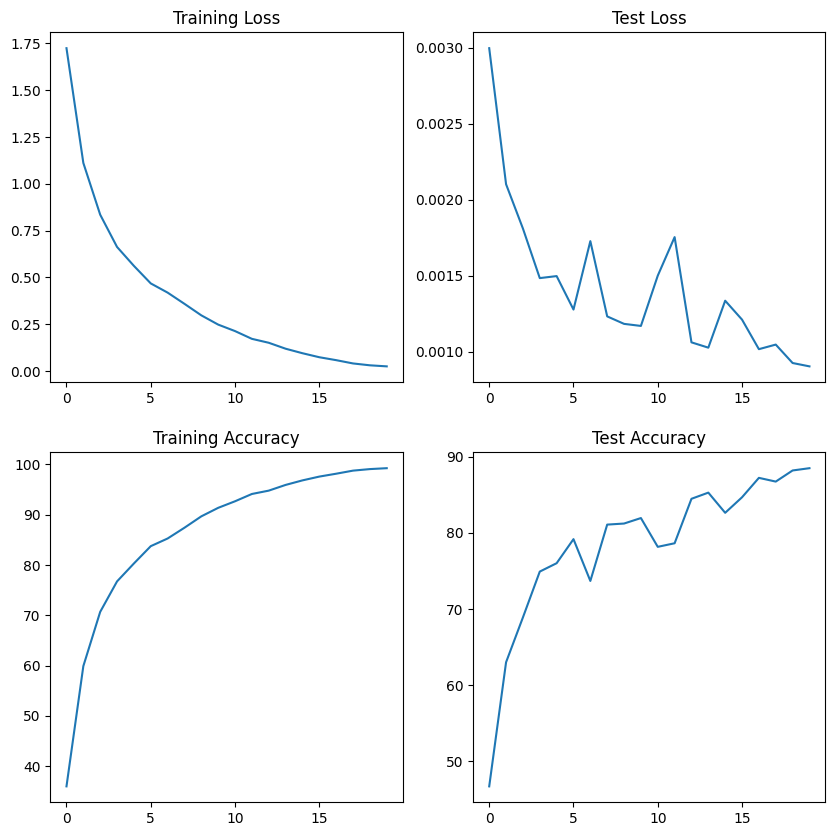
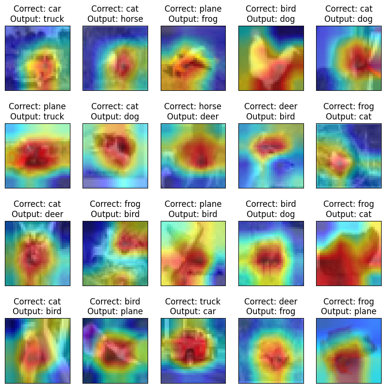

# GradCam and Optimizers

<a target="_blank" href="https://colab.research.google.com/github/Shilpaj1994/ERA/blob/master/Session11/S11.ipynb">
  
</a>

This repository contains following files:

- `resnet.py`: ResNet Model Architecture and it's variants
- `augmentation.py`: Includes the transforms to be applied on the datasets
- `dataset.py`: Contains class to use with [albumentations](https://github.com/albumentations-team/albumentations) library with PyTorch dataset
- `training_utils`: Contains `train`, `test` functions required for model training and `get_lr` function to get current learning rate
- `utils.py`: Contains functions to get misclassified data, dataset statistics, gradcam and model summary
- `visualize.py`: Contains functions to visualize data samples, augmentations, and misclassified images
- `S11.ipynb`: Notebook containing the main code


## Code Details

- In the above notebook, following steps are performed to train a ResNet18 model on CIFAR10 dataset in 20 epochs

- After importing all the modules and files in this repository, CIFAR10 statistics is printed

  ```python
  from utils import get_cifar_statistics
  
  get_cifar_statistics(train)
  get_cifar_statistics(test, data_set_type="Test")
  ```

  ```
  [Train]
   - Total Train Images: 50000
   - Tensor Shape: (3, 32, 32)
   - min: (0.0, 0.0, 0.0)
   - max: (1.0, 1.0, 1.0)
   - mean: (0.49139968, 0.48215827, 0.44653124)
   - std: (0.24703233, 0.24348505, 0.26158768)
   - var: (0.061024975, 0.05928497, 0.06842812)
  [Test]
   - Total Test Images: 10000
   - Tensor Shape: (3, 32, 32)
   - min: (0.0, 0.0, 0.0)
   - max: (1.0, 1.0, 1.0)
   - mean: (0.49421427, 0.48513183, 0.45040932)
   - std: (0.24665256, 0.24289224, 0.26159248)
   - var: (0.06083748, 0.058996636, 0.06843062)
  ```

- Data samples are visualized

  ```python
  from visualize import display_cifar_data_samples
  
  DISPLAY_SAMPLES = 20
  sample, _ = train[4]
  display_cifar_data_samples(train, DISPLAY_SAMPLES, classes)
  ```

  

  

- Augmentation is performed and visualized

  ```python
  from visualize import visualize_cifar_augmentation
  
  aug_train = AlbumDataset('./data', train=True, download=True)
  
  aug_set_transforms = {
      'randomcrop': A.RandomCrop(height=32, width=32, p=1),
      'horizontalflip': A.HorizontalFlip(p=1),
      'cutout': A.CoarseDropout(max_holes=1, max_height=16, max_width=16, min_holes=1, min_height=1, min_width=1, fill_value=(0.49139968*255, 0.48215827*255, 0.44653124*255), mask_fill_value=None, p=1),
      'normalize': A.Normalize((0.49139968, 0.48215827 ,0.44653124), (0.24703233, 0.24348505, 0.26158768)),
      'standardize': ToTensorV2(),
  }
  
  visualize_cifar_augmentation(aug_train, aug_set_transforms)
  ```

  

- ResNet18 model is imported

  ```python
  ----------------------------------------------------------------
          Layer (type)               Output Shape         Param #
  ================================================================
              Conv2d-1           [-1, 64, 32, 32]           1,728
         BatchNorm2d-2           [-1, 64, 32, 32]             128
              Conv2d-3           [-1, 64, 32, 32]          36,864
         BatchNorm2d-4           [-1, 64, 32, 32]             128
              Conv2d-5           [-1, 64, 32, 32]          36,864
         BatchNorm2d-6           [-1, 64, 32, 32]             128
          BasicBlock-7           [-1, 64, 32, 32]               0
          
              Conv2d-8           [-1, 64, 32, 32]          36,864
         BatchNorm2d-9           [-1, 64, 32, 32]             128
             Conv2d-10           [-1, 64, 32, 32]          36,864
        BatchNorm2d-11           [-1, 64, 32, 32]             128
         BasicBlock-12           [-1, 64, 32, 32]               0
          
             Conv2d-13          [-1, 128, 16, 16]          73,728
        BatchNorm2d-14          [-1, 128, 16, 16]             256
             Conv2d-15          [-1, 128, 16, 16]         147,456
        BatchNorm2d-16          [-1, 128, 16, 16]             256
             Conv2d-17          [-1, 128, 16, 16]           8,192
        BatchNorm2d-18          [-1, 128, 16, 16]             256
         BasicBlock-19          [-1, 128, 16, 16]               0
          
             Conv2d-20          [-1, 128, 16, 16]         147,456
        BatchNorm2d-21          [-1, 128, 16, 16]             256
             Conv2d-22          [-1, 128, 16, 16]         147,456
        BatchNorm2d-23          [-1, 128, 16, 16]             256
         BasicBlock-24          [-1, 128, 16, 16]               0
          
             Conv2d-25            [-1, 256, 8, 8]         294,912
        BatchNorm2d-26            [-1, 256, 8, 8]             512
             Conv2d-27            [-1, 256, 8, 8]         589,824
        BatchNorm2d-28            [-1, 256, 8, 8]             512
             Conv2d-29            [-1, 256, 8, 8]          32,768
        BatchNorm2d-30            [-1, 256, 8, 8]             512
         BasicBlock-31            [-1, 256, 8, 8]               0
          
             Conv2d-32            [-1, 256, 8, 8]         589,824
        BatchNorm2d-33            [-1, 256, 8, 8]             512
             Conv2d-34            [-1, 256, 8, 8]         589,824
        BatchNorm2d-35            [-1, 256, 8, 8]             512
         BasicBlock-36            [-1, 256, 8, 8]               0
          
             Conv2d-37            [-1, 512, 4, 4]       1,179,648
        BatchNorm2d-38            [-1, 512, 4, 4]           1,024
             Conv2d-39            [-1, 512, 4, 4]       2,359,296
        BatchNorm2d-40            [-1, 512, 4, 4]           1,024
             Conv2d-41            [-1, 512, 4, 4]         131,072
        BatchNorm2d-42            [-1, 512, 4, 4]           1,024
         BasicBlock-43            [-1, 512, 4, 4]               0
          
             Conv2d-44            [-1, 512, 4, 4]       2,359,296
        BatchNorm2d-45            [-1, 512, 4, 4]           1,024
             Conv2d-46            [-1, 512, 4, 4]       2,359,296
        BatchNorm2d-47            [-1, 512, 4, 4]           1,024
         BasicBlock-48            [-1, 512, 4, 4]               0
          
             Linear-49                   [-1, 10]           5,130
  ================================================================
  Total params: 11,173,962
  Trainable params: 11,173,962
  Non-trainable params: 0
  ----------------------------------------------------------------
  Input size (MB): 0.01
  Forward/backward pass size (MB): 11.25
  Params size (MB): 42.63
  Estimated Total Size (MB): 53.89
  ----------------------------------------------------------------
  ```

- Training Model

  ```python
  from training_utils import train, test, get_lr
  
  # Data to plot accuracy and loss graphs
  train_losses = []
  test_losses = []
  train_acc = []
  test_acc = []
  learning_rates = []
  test_incorrect_pred = {'images': [], 'ground_truths': [], 'predicted_vals': []}
  
  # Scheduler
  scheduler = torch.optim.lr_scheduler.OneCycleLR(optimizer,
                                                  max_lr=MAX_LR,
                                                  steps_per_epoch=STEPS_PER_EPOCH,
                                                  epochs=EPOCHS,
                                                  pct_start=5/EPOCHS,
                                                  div_factor=100,
                                                  three_phase=False,
                                                  final_div_factor=100,
                                                  anneal_strategy="linear"
                                                  )
  
  # For each epoch
  for epoch in range(1, EPOCHS+1):
      print(f'Epoch {epoch}')
  
      # Train the model on training dataset and append the training loss and accuracy
      correct, processed, train_loss = train(model, device, train_loader, optimizer, criterion, scheduler)
      train_acc.append(100 * correct / processed)
      train_losses.append(train_loss / len(train_loader))
      learning_rates.append(get_lr(optimizer))
  
      # Test the model's performance on test dataset and append the training loss and accuracy
      correct, test_loss = test(model, device, test_loader, criterion)
      test_acc.append(100. * correct / len(test_loader.dataset))
      test_losses.append(test_loss)
  ```

  ```
  Epoch 15
  Train: Loss=0.0699 Batch_id=97 Accuracy=97.05: 100%|██████████| 98/98 [00:41<00:00,  2.36it/s]
  Test set: Average loss: 0.0012, Accuracy: 8354/10000 (83.54%)
  
  Epoch 16
  Train: Loss=0.0788 Batch_id=97 Accuracy=97.47: 100%|██████████| 98/98 [00:41<00:00,  2.38it/s]
  Test set: Average loss: 0.0011, Accuracy: 8554/10000 (85.54%)
  
  Epoch 17
  Train: Loss=0.0368 Batch_id=97 Accuracy=98.25: 100%|██████████| 98/98 [00:41<00:00,  2.37it/s]
  Test set: Average loss: 0.0010, Accuracy: 8696/10000 (86.96%)
  
  Epoch 18
  Train: Loss=0.0626 Batch_id=97 Accuracy=98.63: 100%|██████████| 98/98 [00:41<00:00,  2.38it/s]
  Test set: Average loss: 0.0010, Accuracy: 8716/10000 (87.16%)
  
  Epoch 19
  Train: Loss=0.0285 Batch_id=97 Accuracy=99.15: 100%|██████████| 98/98 [00:41<00:00,  2.37it/s]
  Test set: Average loss: 0.0010, Accuracy: 8746/10000 (87.46%)
  
  Epoch 20
  Train: Loss=0.0166 Batch_id=97 Accuracy=99.24: 100%|██████████| 98/98 [00:41<00:00,  2.37it/s]
  Test set: Average loss: 0.0009, Accuracy: 8837/10000 (88.37%)
  ```

  

- One Cycle Policy is used to train the models. Following is the graph showing model accuracy and loss on train and test dataset

  ```python
  # Print loss and accuracy
  from visualize import display_loss_and_accuracies
  
  display_loss_and_accuracies(train_losses, train_acc, test_losses, test_acc)
  ```

  

- Misclassified images are visualized

  ```python
  from utils import get_misclassified_data
  from visualize import display_cifar_misclassified_data
  
  # Denormalize the data using test mean and std deviation
  inv_normalize = transforms.Normalize(
      mean=[-0.4942/0.2466, -0.4851/0.2428, -0.4504/0.2615],
      std=[1/0.2466, 1/0.2428, 1/0.2615]
  )
  
  # Get the misclassified data from test dataset
  misclassified_data = get_misclassified_data(model, device, test_loader)
  
  # Plot the misclassified data
  display_cifar_misclassified_data(misclassified_data, classes, inv_normalize, number_of_samples=10)
  ```
  
  

- GradCam is used to visualize the activations of the detected class on the misclassified images

  

  

---


## GradCam

- 
