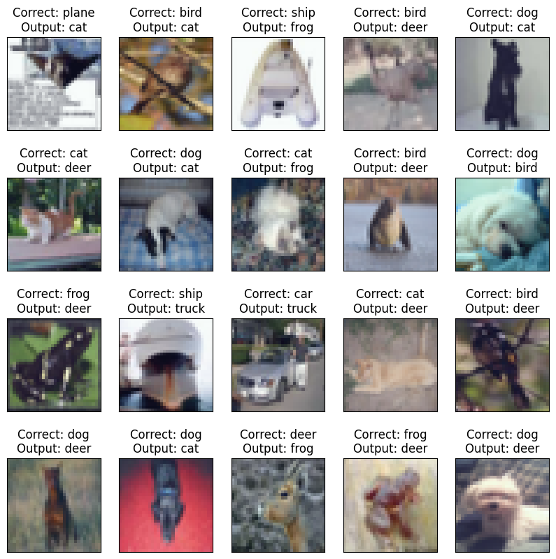
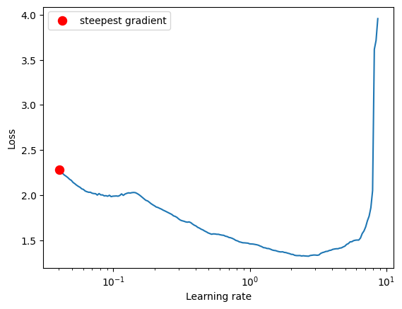

# Training Models Faster - One Cycle Policy

<a target="_blank" href="https://colab.research.google.com/github/Shilpaj1994/ERA/blob/master/Session11/S11.ipynb">
  
</a>

This repository contains following files:

- `resnet.py`: ResNet Model Architecture and it's variants
- `dataset.py`: Contains class to use with [albumentations](https://github.com/albumentations-team/albumentations) library with PyTorch dataset
- `training_utils`: Contains `train`, `test` functions required for model training and `get_lr` function to get current learning rate
- `utils.py`: Contains functions to get misclassified data, dataset statistics, gradcam and model summary
- `visualize.py`: Contains functions to visualize data samples, augmentations, and misclassified images
- `S11: Notebook containing code


## Code Details

- In the above notebook, following steps are performed to achieve **90%+** accuracy on CIFAR10 dataset in **24 epochs**

- After importing all the modules and files in this repository, CIFAR10 statistics is printed

  ```python
  from utils import get_cifar_statistics
  
  get_cifar_statistics(train)
  get_cifar_statistics(test, data_set_type="Test")
  ```

  ```
  [Train]
   - Total Train Images: 50000
   - Tensor Shape: (3, 32, 32)
   - min: (0.0, 0.0, 0.0)
   - max: (1.0, 1.0, 1.0)
   - mean: (0.49139968, 0.48215827, 0.44653124)
   - std: (0.24703233, 0.24348505, 0.26158768)
   - var: (0.061024975, 0.05928497, 0.06842812)
  [Test]
   - Total Test Images: 10000
   - Tensor Shape: (3, 32, 32)
   - min: (0.0, 0.0, 0.0)
   - max: (1.0, 1.0, 1.0)
   - mean: (0.49421427, 0.48513183, 0.45040932)
   - std: (0.24665256, 0.24289224, 0.26159248)
   - var: (0.06083748, 0.058996636, 0.06843062)
  ```

- Data samples are visualized

  ```python
  from visualize import display_cifar_data_samples
  
  DISPLAY_SAMPLES = 20
  sample, _ = train[4]
  display_cifar_data_samples(train, DISPLAY_SAMPLES, classes)
  ```

  

  

- Augmentation is performed and visualized

  ```python
  from visualize import visualize_cifar_augmentation
  
  aug_train = AlbumDataset('./data', train=True, download=True)
  
  aug_set_transforms = {
      'randomcrop': A.RandomCrop(height=32, width=32, p=1),
      'horizontalflip': A.HorizontalFlip(p=1),
      'cutout': A.CoarseDropout(max_holes=1, max_height=16, max_width=16, min_holes=1, min_height=1, min_width=1, fill_value=(0.49139968*255, 0.48215827*255, 0.44653124*255), mask_fill_value=None, p=1),
      'normalize': A.Normalize((0.49139968, 0.48215827 ,0.44653124), (0.24703233, 0.24348505, 0.26158768)),
      'standardize': ToTensorV2(),
  }
  
  visualize_cifar_augmentation(aug_train, aug_set_transforms)
  ```

  

- David's custom model is recreated and imported

  

  ```python
  ----------------------------------------------------------------
          Layer (type)               Output Shape         Param #
  ================================================================
              Conv2d-1           [-1, 64, 32, 32]           1,728
         BatchNorm2d-2           [-1, 64, 32, 32]             128
                ReLU-3           [-1, 64, 32, 32]               0
              
              Conv2d-4          [-1, 128, 32, 32]          73,728
           MaxPool2d-5          [-1, 128, 16, 16]               0
         BatchNorm2d-6          [-1, 128, 16, 16]             256
                ReLU-7          [-1, 128, 16, 16]               0
          
              Conv2d-8          [-1, 128, 16, 16]         147,456
         BatchNorm2d-9          [-1, 128, 16, 16]             256
               ReLU-10          [-1, 128, 16, 16]               0
          
             Conv2d-11          [-1, 128, 16, 16]         147,456
        BatchNorm2d-12          [-1, 128, 16, 16]             256
               ReLU-13          [-1, 128, 16, 16]               0
          
             Conv2d-14          [-1, 256, 16, 16]         294,912
          MaxPool2d-15            [-1, 256, 8, 8]               0
        BatchNorm2d-16            [-1, 256, 8, 8]             512
               ReLU-17            [-1, 256, 8, 8]               0
          
             Conv2d-18            [-1, 512, 8, 8]       1,179,648
          MaxPool2d-19            [-1, 512, 4, 4]               0
        BatchNorm2d-20            [-1, 512, 4, 4]           1,024
               ReLU-21            [-1, 512, 4, 4]               0
          
             Conv2d-22            [-1, 512, 4, 4]       2,359,296
        BatchNorm2d-23            [-1, 512, 4, 4]           1,024
               ReLU-24            [-1, 512, 4, 4]               0
          
             Conv2d-25            [-1, 512, 4, 4]       2,359,296
        BatchNorm2d-26            [-1, 512, 4, 4]           1,024
               ReLU-27            [-1, 512, 4, 4]               0
          
          MaxPool2d-28            [-1, 512, 1, 1]               0
          
             Linear-29                   [-1, 10]           5,120
  ================================================================
  Total params: 6,573,120
  Trainable params: 6,573,120
  Non-trainable params: 0
  ----------------------------------------------------------------
  Input size (MB): 0.01
  Forward/backward pass size (MB): 6.44
  Params size (MB): 25.07
  Estimated Total Size (MB): 31.53
  ----------------------------------------------------------------
  ```

- Training Model

  ```python
  from training_utils import train, test, get_lr
  
  # Data to plot accuracy and loss graphs
  train_losses = []
  test_losses = []
  train_acc = []
  test_acc = []
  learning_rates = []
  test_incorrect_pred = {'images': [], 'ground_truths': [], 'predicted_vals': []}
  
  # Scheduler
  scheduler = torch.optim.lr_scheduler.OneCycleLR(optimizer,
                                                  max_lr=MAX_LR,
                                                  steps_per_epoch=STEPS_PER_EPOCH,
                                                  epochs=EPOCHS,
                                                  pct_start=5/EPOCHS,
                                                  div_factor=100,
                                                  three_phase=False,
                                                  final_div_factor=100,
                                                  anneal_strategy="linear"
                                                  )
  
  # For each epoch
  for epoch in range(1, EPOCHS+1):
      print(f'Epoch {epoch}')
  
      # Train the model on training dataset and append the training loss and accuracy
      correct, processed, train_loss = train(model, device, train_loader, optimizer, criterion, scheduler)
      train_acc.append(100 * correct / processed)
      train_losses.append(train_loss / len(train_loader))
      learning_rates.append(get_lr(optimizer))
  
      # Test the model's performance on test dataset and append the training loss and accuracy
      correct, test_loss = test(model, device, test_loader, criterion)
      test_acc.append(100. * correct / len(test_loader.dataset))
      test_losses.append(test_loss)
  ```

  ```
  Epoch 20
  Train: Loss=0.3043 Batch_id=97 Accuracy=85.94: 100%|██████████| 98/98 [00:19<00:00,  4.98it/s]
  Test set: Average loss: 0.0010, Accuracy: 8376/10000 (83.76%)
  
  Epoch 21
  Train: Loss=0.3184 Batch_id=97 Accuracy=87.84: 100%|██████████| 98/98 [00:19<00:00,  5.08it/s]
  Test set: Average loss: 0.0009, Accuracy: 8434/10000 (84.34%)
  
  Epoch 22
  Train: Loss=0.3085 Batch_id=97 Accuracy=89.75: 100%|██████████| 98/98 [00:19<00:00,  5.06it/s]
  Test set: Average loss: 0.0008, Accuracy: 8733/10000 (87.33%)
  
  Epoch 23
  Train: Loss=0.2157 Batch_id=97 Accuracy=91.94: 100%|██████████| 98/98 [00:19<00:00,  5.04it/s]
  Test set: Average loss: 0.0007, Accuracy: 8887/10000 (88.87%)
  
  Epoch 24
  Train: Loss=0.0953 Batch_id=97 Accuracy=94.75: 100%|██████████| 98/98 [00:19<00:00,  5.08it/s]
  Test set: Average loss: 0.0006, Accuracy: 9003/10000 (90.03%)
  ```

  

- One Cycle Policy is used to train the models. Following is the graph showing model accuracy and loss on train and test dataset

  ```python
  # Print loss and accuracy
  from visualize import display_loss_and_accuracies
  
  display_loss_and_accuracies(train_losses, train_acc, test_losses, test_acc)
  ```

  

- Misclassified images are visualized

  ```python
  from utils import get_misclassified_data
  from visualize import display_cifar_misclassified_data
  
  # Denormalize the data using test mean and std deviation
  inv_normalize = transforms.Normalize(
      mean=[-0.4942/0.2466, -0.4851/0.2428, -0.4504/0.2615],
      std=[1/0.2466, 1/0.2428, 1/0.2615]
  )
  
  # Get the misclassified data from test dataset
  misclassified_data = get_misclassified_data(model, device, test_loader)
  
  # Plot the misclassified data
  display_cifar_misclassified_data(misclassified_data, classes, inv_normalize, number_of_samples=10)
  ```
  
  


---


## One Cycle Policy

- One Cycle Policy was invented by Leslie Smith. [Paper Link](https://arxiv.org/abs/1803.09820)

- There are three phase in One Cycle Policy

  1. Learning rate is increased from initial value to maximum learning rate
  2. Learning rate is reduced from maximum value to end learning rate
  3. Annealing phase where learning rate is further reduced based on the strategy

- In the One Cycle Policy, we first start with a minimum learning rate and keep on increasing it till we reach the maximum value and then keep on reducing it till we reach the minimum value

- Due to increasing learning rate in the first phase, the model tries to jump over the local minima and tries to converge over the global minima

- After certain epoch we start reducing learning rate so that model is able to converge properly at the global minima

- There are two steps to implement One Cycle Policy:

  1. To find the maximum learning rate using `lr_finder`

  2. To use OneCycle LR scheduler during training


### Step-1 [Find Max LR]

- Install and import lr_finder

  ```python
  # Install and import lr-finder
  !pip install torch-lr-finder
  from torch_lr_finder import LRFinder
  ```

- Select model, optimizer and loss function

  ```python
  # Put the model on selected device
  model = Session10Net().to(device)
  
  # Optimization algorithm to update the weights
  LEARNING_RATE = 0.03
  WEIGHT_DECAY = 1e-4
  optimizer = optim.Adam(model.parameters(), lr=LEARNING_RATE, weight_decay=WEIGHT_DECAY)
  
  # Loss Function
  criterion = nn.CrossEntropyLoss()
  ```

- Get the max learning rate value

  ```python
  # LR finder
  lr_finder = LRFinder(model, optimizer, criterion, device='cuda')
  lr_finder.range_test(train_loader, end_lr=10, num_iter=200, step_mode="exp")
  lr_finder.plot()
  lr_finder.reset()
  ```

  The above will print out following statements and graph

  ```bash
  Stopping early, the loss has diverged
  Learning rate search finished. See the graph with {finder_name}.plot()
  LR suggestion: steepest gradient
  Suggested LR: 5.54E-02
  ```

  

- The graphs shows how the loss value is affected by different values of learning rate

- As per the graph, rate of change of loss value is maximum for a learning rate of `5.54E-02`

- So, we will consider this as the maximum value of the learning rate


### Step-2 [Implementation]

- To implement this policy, we need to use a scheduler from PyTorch

  ```python
  # Scheduler
  scheduler = torch.optim.lr_scheduler.OneCycleLR(optimizer,
                                                  max_lr=5.54E-02,
                                                  steps_per_epoch=len(train_loader),
                                                  epochs=24,
                                                  pct_start=5/24,
                                                  div_factor=100,
                                                  three_phase=False,
                                                  final_div_factor=100,
                                                  anneal_strategy="linear"
                                                  )
  ```

  `max_lr`: Maximum value of learning rate found in step-1

  `steps_per_epoch`: Number of times learning rate to be modified in each epoch

  `epochs`: Total number of epochs

  `pct_start`: For what percentage of total epochs, learning rate should be raising (Usually 20-30%)

  `div_factor`: Starting learning rate to be decided by dividing maximum learning rate by this value (Usually 100)

  `three_phase`: Selecting if annealing phase to be used

  `final_div_factor`: End learning rate to be decided by dividing maximum learning rate by this value (Usually 100)

  `anneal_strategy`: Strategy to be used in annealing phase

- After using the scheduler for model training, the learning rate variation looks like this

  

  
