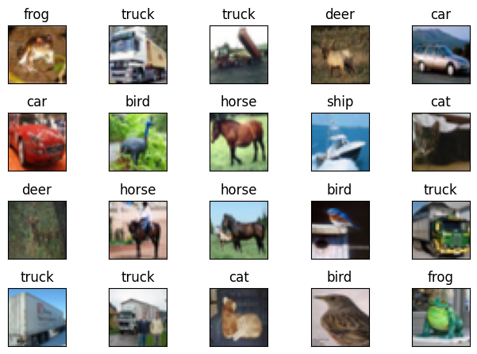
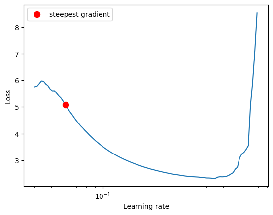
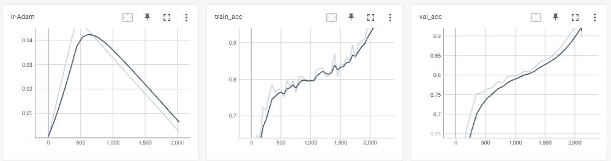
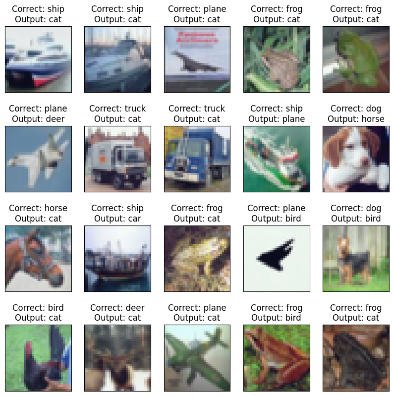

# PyTorch Lightning

<a target="_blank" href="https://colab.research.google.com/github/Shilpaj1994/ERA/blob/master/Session12/S12.ipynb">
  
</a>

This repository contains following files:

- `resnet.py`: Model Architecture by [David C](https://github.com/davidcpage)
- `dataset.py`: Contains class to use with [albumentations](https://github.com/albumentations-team/albumentations) library with PyTorch dataset
- `utils.py`: Contains functions to get misclassified data, dataset statistics and model summary
- `visualize.py`: Contains functions to visualize data samples, augmentations, and misclassified images
- `S12`: Notebook containing model training code


## Code Details

- In the above notebook, following steps are performed to achieve **90%+** accuracy on CIFAR10 dataset in **24 epochs**

- The model is trained using PyTorch Lightning

- Using Lightning makes the code more compact, modular, easy to log and monitor parameters along with the saving checkpoints and early stopping based on different criteria

  

### Model

- After importing all the modules and files in this repository, instance of the Network class is created
- The network class `LITResNet` is a child of two classes:
  - LightningModule
  - Layers
- Layers is a custom class containing different convolutional layers which make the core more organized and readable

```python
classes = ('plane', 'car', 'bird', 'cat', 'deer',
           'dog', 'frog', 'horse', 'ship', 'truck')

model = LITResNet(classes)
model
```

```bash
(prep_layer): Sequential(
    (0): Conv2d(3, 64, kernel_size=(3, 3), stride=(1, 1), padding=(1, 1), bias=False)
    (1): BatchNorm2d(64, eps=1e-05, momentum=0.1, affine=True, track_running_stats=True)
    (2): ReLU()
  )
  (custom_block1): Sequential(
    (0): Conv2d(64, 128, kernel_size=(3, 3), stride=(1, 1), padding=(1, 1), bias=False)
    (1): MaxPool2d(kernel_size=2, stride=2, padding=0, dilation=1, ceil_mode=False)
    (2): BatchNorm2d(128, eps=1e-05, momentum=0.1, affine=True, track_running_stats=True)
    (3): ReLU()
  )
  (resnet_block1): Sequential(
    (0): Conv2d(128, 128, kernel_size=(3, 3), stride=(1, 1), padding=(1, 1), bias=False)
    (1): BatchNorm2d(128, eps=1e-05, momentum=0.1, affine=True, track_running_stats=True)
    (2): ReLU()
    (3): Conv2d(128, 128, kernel_size=(3, 3), stride=(1, 1), padding=(1, 1), bias=False)
    (4): BatchNorm2d(128, eps=1e-05, momentum=0.1, affine=True, track_running_stats=True)
    (5): ReLU()
  )
  (custom_block2): Sequential(
    (0): Conv2d(128, 256, kernel_size=(3, 3), stride=(1, 1), padding=(1, 1), bias=False)
    (1): MaxPool2d(kernel_size=2, stride=2, padding=0, dilation=1, ceil_mode=False)
    (2): BatchNorm2d(256, eps=1e-05, momentum=0.1, affine=True, track_running_stats=True)
    (3): ReLU()
  )
  (custom_block3): Sequential(
    (0): Conv2d(256, 512, kernel_size=(3, 3), stride=(1, 1), padding=(1, 1), bias=False)
    (1): MaxPool2d(kernel_size=2, stride=2, padding=0, dilation=1, ceil_mode=False)
    (2): BatchNorm2d(512, eps=1e-05, momentum=0.1, affine=True, track_running_stats=True)
    (3): ReLU()
  )
  (resnet_block3): Sequential(
    (0): Conv2d(512, 512, kernel_size=(3, 3), stride=(1, 1), padding=(1, 1), bias=False)
    (1): BatchNorm2d(512, eps=1e-05, momentum=0.1, affine=True, track_running_stats=True)
    (2): ReLU()
    (3): Conv2d(512, 512, kernel_size=(3, 3), stride=(1, 1), padding=(1, 1), bias=False)
    (4): BatchNorm2d(512, eps=1e-05, momentum=0.1, affine=True, track_running_stats=True)
    (5): ReLU()
  )
  (pool4): MaxPool2d(kernel_size=4, stride=2, padding=0, dilation=1, ceil_mode=False)
  (fc): Linear(in_features=512, out_features=10, bias=False)
)
```


### Data Statistics

- All the data related hooks are part of the same model class
- Hence the process of extract, load and transforming is done with the method of the class

```python
model.get_statistics()
model.get_statistics(data_set_type="Test")
```

```
[Train]
 - Total Train Images: 50000
 - Tensor Shape: (3, 32, 32)
 - min: (0.0, 0.0, 0.0)
 - max: (1.0, 1.0, 1.0)
 - mean: (0.49139968, 0.48215827, 0.44653124)
 - std: (0.24703233, 0.24348505, 0.26158768)
 - var: (0.061024975, 0.05928497, 0.06842812)
[Test]
 - Total Test Images: 10000
 - Tensor Shape: (3, 32, 32)
 - min: (0.0, 0.0, 0.0)
 - max: (1.0, 1.0, 1.0)
 - mean: (0.49421427, 0.48513183, 0.45040932)
 - std: (0.24665256, 0.24289224, 0.26159248)
 - var: (0.06083748, 0.058996636, 0.06843062)
```


### Data Visualization

```python
model.display_data_samples()
```




### Data Augmentation

```python
aug_set_transforms = {
    'randomcrop': A.RandomCrop(height=32, width=32, p=1),
    'horizontalflip': A.HorizontalFlip(p=1),
    'cutout': A.CoarseDropout(max_holes=1, max_height=16, max_width=16, min_holes=1, min_height=1, min_width=1, fill_value=(0.49139968*255, 0.48215827*255, 0.44653124*255), mask_fill_value=None, p=1),
    'normalize': A.Normalize((0.49139968, 0.48215827 ,0.44653124), (0.24703233, 0.24348505, 0.26158768)),
    'standardize': ToTensorV2(),
}

model.visualize_augmentation(aug_set_transforms)
```


### Data Transformations

Training and test data transformation is done using `set_transforms()`

```python
# Train Phase transformations
train_set_transforms = {
    'randomcrop': A.RandomCrop(height=32, width=32, p=0.2),
    'horizontalflip': A.HorizontalFlip(),
    'cutout': A.CoarseDropout(max_holes=1, max_height=16, max_width=16, min_holes=1, min_height=1, min_width=1, fill_value=[0.49139968*255, 0.48215827*255 ,0.44653124*255], mask_fill_value=None),
    'normalize': A.Normalize((0.49139968, 0.48215827 ,0.44653124), (0.24703233, 0.24348505, 0.26158768)),
    'standardize': ToTensorV2(),
}

# Test Phase transformations
test_set_transforms = {
    'normalize': A.Normalize((0.49139968, 0.48215827, 0.44653124), (0.24703233, 0.24348505, 0.26158768)),
    'standardize': ToTensorV2()
}

# Set transformations for training and test dataset
model.set_transforms(train_set_transforms, test_set_transforms)
```


### Learning Rate Finder

- LRFinder is used to find the optimal starting learning rate
- One Cycle Policy is used to modify learning rate during training
- A value of ` 6.04E-02` is taken as maximum learning rate



### Training Configuration

- `LearningRateMonitor` from PyTorch Lightning module is used to monitor learning rate during training
- `ModelCheckpoint` from PyTorch Lightning module is used to save the model during training based on the validation loss
- `ModelSummary` from PyTorch Lightning module is used to print the network summary
- `Trainer` from PyTorch Lightning module is used to train the model 

```python
# Monitor Learning rate while training to verify correct implementation of OCP
lr_monitor = LearningRateMonitor(logging_interval="epoch")

# Save the last best model based on validation loss
checkpoint_callback = ModelCheckpoint(
    save_top_k=1,
    verbose=True,
    monitor='val_loss',
    mode='min',
)

# Define trainer for model training
trainer = pl.Trainer(
    callbacks=[ModelSummary(max_depth=-1), lr_monitor, checkpoint_callback],
    max_epochs = EPOCHS,
    check_val_every_n_epoch=1,
    num_sanity_val_steps=1
)

# Train the Model
trainer.fit(model)
```


### Model Training

- Model Summary 

```python
   | Name            | Type               | Params
--------------------------------------------------------
0  | inv_normalize   | Normalize          | 0     
1  | accuracy        | MulticlassAccuracy | 0     
2  | prep_layer      | Sequential         | 1.9 K 
3  | prep_layer.0    | Conv2d             | 1.7 K 
4  | prep_layer.1    | BatchNorm2d        | 128   
5  | prep_layer.2    | ReLU               | 0     
6  | custom_block1   | Sequential         | 74.0 K
7  | custom_block1.0 | Conv2d             | 73.7 K
8  | custom_block1.1 | MaxPool2d          | 0     
9  | custom_block1.2 | BatchNorm2d        | 256   
10 | custom_block1.3 | ReLU               | 0     
11 | resnet_block1   | Sequential         | 295 K 
12 | resnet_block1.0 | Conv2d             | 147 K 
13 | resnet_block1.1 | BatchNorm2d        | 256   
14 | resnet_block1.2 | ReLU               | 0     
15 | resnet_block1.3 | Conv2d             | 147 K 
16 | resnet_block1.4 | BatchNorm2d        | 256   
17 | resnet_block1.5 | ReLU               | 0     
18 | custom_block2   | Sequential         | 295 K 
19 | custom_block2.0 | Conv2d             | 294 K 
20 | custom_block2.1 | MaxPool2d          | 0     
21 | custom_block2.2 | BatchNorm2d        | 512   
22 | custom_block2.3 | ReLU               | 0     
23 | custom_block3   | Sequential         | 1.2 M 
24 | custom_block3.0 | Conv2d             | 1.2 M 
25 | custom_block3.1 | MaxPool2d          | 0     
26 | custom_block3.2 | BatchNorm2d        | 1.0 K 
27 | custom_block3.3 | ReLU               | 0     
28 | resnet_block3   | Sequential         | 4.7 M 
29 | resnet_block3.0 | Conv2d             | 2.4 M 
30 | resnet_block3.1 | BatchNorm2d        | 1.0 K 
31 | resnet_block3.2 | ReLU               | 0     
32 | resnet_block3.3 | Conv2d             | 2.4 M 
33 | resnet_block3.4 | BatchNorm2d        | 1.0 K 
34 | resnet_block3.5 | ReLU               | 0     
35 | pool4           | MaxPool2d          | 0     
36 | fc              | Linear             | 5.1 K 
--------------------------------------------------------
6.6 M     Trainable params
0         Non-trainable params
6.6 M     Total params
26.292    Total estimated model params size (MB)
```

- Training Logs

```bash
INFO:pytorch_lightning.utilities.rank_zero:Epoch 20, global step 1848: 'val_loss' reached 0.44312 (best 0.44312), saving model to '/content/lightning_logs/version_0/checkpoints/epoch=20-step=1848.ckpt' as top 1
Validation: 0it [00:00, ?it/s]

INFO:pytorch_lightning.utilities.rank_zero:Epoch 21, global step 1936: 'val_loss' reached 0.39874 (best 0.39874), saving model to '/content/lightning_logs/version_0/checkpoints/epoch=21-step=1936.ckpt' as top 1
Validation: 0it [00:00, ?it/s]

INFO:pytorch_lightning.utilities.rank_zero:Epoch 22, global step 2024: 'val_loss' reached 0.36174 (best 0.36174), saving model to '/content/lightning_logs/version_0/checkpoints/epoch=22-step=2024.ckpt' as top 1
Validation: 0it [00:00, ?it/s]

INFO:pytorch_lightning.utilities.rank_zero:Epoch 23, global step 2112: 'val_loss' reached 0.31670 (best 0.31670), saving model to '/content/lightning_logs/version_0/checkpoints/epoch=23-step=2112.ckpt' as top 1
INFO:pytorch_lightning.utilities.rank_zero:`Trainer.fit` stopped: `max_epochs=24` reached.
```

- Test Accuracy

  ```python
  trainer.test()
  ```

  ```bash
  ┏━━━━━━━━━━━━━━━━━━━━━━━━━━━━━━┳━━━━━━━━━━━━━━━━━━━━━━━━━━━━━┓
  ┃        Test metric        ┃       DataLoader 0        ┃
  ┡━━━━━━━━━━━━━━━━━━━━━━━━━━━━━━╇━━━━━━━━━━━━━━━━━━━━━━━━━━━━━┩
  │          val_acc          │    0.9013000130653381     │
  │         val_loss          │    0.30677518248558044    │
  └───────────────────────────┴───────────────────────────┘
  ```

- Validation Accuracy

  ```python
  trainer.validate()
  ```

  ```bash
  ┏━━━━━━━━━━━━━━━━━━━━━━━━━━━━━━┳━━━━━━━━━━━━━━━━━━━━━━━━━━━┓
  ┃      Validate metric      ┃       DataLoader 0      ┃
  ┡━━━━━━━━━━━━━━━━━━━━━━━━━━━━━━╇━━━━━━━━━━━━━━━━━━━━━━━━━━━┩
  │          val_acc          │     0.897599995136261   │
  │         val_loss          │    0.3127770721912384   │
  └───────────────────────────┴─────────────────────────┘
  ```


### Training Logs

- Training data is recorded during training
- Values can be logged using `self.log("ParamName", value)`
- Following are the learning rate, training and test accuracies logged during model training

```python
# start tensorboard
%load_ext tensorboard
%tensorboard --logdir lightning_logs/
```




### Display Misclassified IMages




### Save Misclassified Images

- Misclassified Images are saved on the drive to be shown on the Gradio App

  ```python
  for data in misclassified_data:
      # Extract misclassified image
      misclassified_img = data[0]
  
      # Denormalize and remap pixels to 0-255
      misclassified_img = model.inv_normalize(misclassified_img) * 255
  
      # Conver to numpy array
      ndarray_img = misclassified_img.cpu().numpy().squeeze(0).astype(np.uint8)
  
      # Channel repositioning
      rgb_img = np.transpose(ndarray_img, (1, 2, 0))
  
      # Convert to PIL format
      img = Image.fromarray(rgb_img)
  
      # Resize
      img.resize((416, 416))
  
      # File name = correct_misclassified.png
      file_name = str(classes[data[1].item()]) + '_' + str(classes[data[2].item()]) + '.png'
  
      # Save the image
      img.save(img_dir+file_name)
  ```

  

---


## Gradio App


<a target="_blank" href="https://colab.research.google.com/github/Shilpaj1994/ERA/blob/master/Session12/S12App.ipynb">
  
</a>

- Trained model from above code is used to perform inference on the Gradio app
- The above notebook contains code to create and visualize the app on the Colab

- Following are the code details for the Gradio app


### Load Model

```python
classes = ('plane', 'car', 'bird', 'cat', 'deer',
           'dog', 'frog', 'horse', 'ship', 'truck')

model = LITResNet.load_from_checkpoint(model_path, map_location=torch.device('cpu'), strict=False, class_names=classes)
model.eval()
```


### GradCam

- Image is taken as an input from the user along with the transparency values, number of top classes and target layer for GradCam
- After normalizing the image, it is sent to model and predictions are recorded
- Based on the input of number of top classes, the prediction results are displayed on the app
- Based on the layer number and transparency, GradCam image is displayed on the app

```python
from collections import OrderedDict

def inference(input_img,
              transparency=0.5,
              number_of_top_classes=3,
              target_layer_number=4):
    """
    Function to run inference on the input image
    :param input_img: Image provided by the user
    :parma transparency:
    :param number_of_top_classes:
    :param target_layer_number:
    """
    # Calculate mean over each channel of input image
    mean_r, mean_g, mean_b = np.mean(input_img[:, :, 0]/255.), np.mean(input_img[:, :, 1]/255.), np.mean(input_img[:, :, 2]/255.)

    # Calculate Standard deviation over each channel
    std_r, std_g, std_b = np.std(input_img[:, :, 0]/255.), np.std(input_img[:, :, 1]/255.), np.std(input_img[:, :, 2]/255.)

    # Convert img to tensor and normalize it
    _transform = transforms.Compose([
        transforms.ToTensor(),
        transforms.Normalize((mean_r, mean_g, mean_b), (std_r, std_g, std_b))
        ])

    # Save a copy of input img
    org_img = input_img

    # Apply the transforms on the input image
    input_img = _transform(input_img)

    # Add batch dimension to perform inference
    input_img = input_img.unsqueeze(0)

    # Get Model Predictions
    with torch.no_grad():
        outputs = model(input_img)
        o = torch.exp(outputs)[0]
        confidences = {classes[i]: float(o[i]) for i in range(10)}

    # Select the top classes based on user input
    sorted_confidences = sorted(confidences.items(), key=lambda val: val[1], reverse=True)
    show_confidences = OrderedDict(sorted_confidences[:number_of_top_classes])

    # Name of layers defined in the model
    _layers = ['prep_layer', 'custom_block1', 'resnet_block1',
               'custom_block2', 'custom_block3', 'resnet_block3']
    target_layers = [eval(f'model.{_layers[target_layer_number-1]}[0]')]

    # Get the class activations from the selected layer
    cam = GradCAM(model=model, target_layers=target_layers, use_cuda=False)
    grayscale_cam = cam(input_tensor=input_img, targets=None)
    grayscale_cam = grayscale_cam[0, :]

    # Overlay input image with Class activations
    visualization = show_cam_on_image(org_img/255, grayscale_cam, use_rgb=True, image_weight=transparency)
    return show_confidences, visualization
```


### Misclassified Images

- Number of misclassified images to be seen is taken as input
- Images from the misclassified directory are imported as shown based on the number input by the user
- Name of the files are in saved in `correct_misclassified.png` format
- Using this, correct and misclassified classes name are extracted and shown on the app

```python
def display_misclassified_images(number: int = 1):
    """
    Display the misclassified images saved during training
    :param number: Number of images to display
    """
    # List to store names of misclassified images
    data = []

    # Get the names of all the files from Misclassified directory
    file_names = os.listdir(dir+'misclassified/')

    # Save the correct name and misclassified class name as a tuple in the `data` list
    for file in file_names:
        file_name, extension = file.split('.')
        correct_label, misclassified = file_name.split('_')
        data.append((correct_label, misclassified))

    # Create a path to the images for Gradio to access them
    file_path = [dir+'misclassified/'+file for file in file_names]

    # Return the file path and names of correct and misclassified images
    return file_path[:number], data[:number]
```


### Feature Maps Visualization

- Feature map from a specific kernel number from all 6 layers is visualized
- Following is the code for feature map visualization

```python
# Create an object of the Class
viz = FeatureMapVisualizer(model)

def feature_maps(input_img, kernel_number=32):
    """
    Function to return feature maps for the selected image
    :param kernel_number: Number of kernel in all 6 layers
    """
    # Calculate mean over each channel of input image
    mean_r, mean_g, mean_b = np.mean(input_img[:, :, 0]/255.), np.mean(input_img[:, :, 1]/255.), np.mean(input_img[:, :, 2]/255.)

    # Calculate Standard deviation over each channel
    std_r, std_g, std_b = np.std(input_img[:, :, 0]/255.), np.std(input_img[:, :, 1]/255.), np.std(input_img[:, :, 2]/255.)

    # Convert img to tensor and normalize it
    _transform = transforms.Compose([
        transforms.ToTensor(),
        transforms.Normalize((mean_r, mean_g, mean_b), (std_r, std_g, std_b))
        ])

    # Apply transforms on the input image
    input_img = _transform(input_img)

    # Visualize feature maps for kernel number 32
    plt = viz.visualize_feature_map_of_kernel(image=input_img, kernel_number=kernel_number)
    return plt
```


### Kernel Visualization

- From the six blocks of the network, kernel's from each first layer of each block are visualized

```python
# Create an object of the Class
viz = FeatureMapVisualizer(model)

def get_kernels(layer_number):
    """
    Function to get the kernels from the layer
    :param layer_number: Number of layer from which kernels to be visualized
    """
    # Visualize kernels from layer
    plt = viz.visualize_kernels_from_layer(layer_number=layer_number)
    return plt
```


### App

- Following is the code for the app
- The app has four tabs:
  - GradCam
  - Misclassified Images
  - Feature Maps
  - Kernels
- Each tab has a separate set of inputs, outputs and click buttons

```python
with gr.Blocks() as demo:
    gr.Markdown(
        """
        # CIFAR10 trained on ResNet18 Model
           - A model architecture by [David C](https://github.com/davidcpage) which is trained on CIFAR10 for 24 Epochs to achieve accuracy of 90+%
           - One Cycle Policy is used during training to speed up the trainig process
           - The model works for following classes: `plane`, `car`, `bird`, `cat`, `deer`, `dog`, `frog`, `horse`, `ship`, `truck`

        ### A simple Gradio interface
        - To infer what exactly the model is looking at using GradCAM results
        - To display the misclassified images from the 10% of test data of CIFAR10 dataset
        - To visualize the feature maps from each of the six convolutional block's first layer
        - To visualize the kernels from each of the six convolutional block's first layer
        """
    )

    # #############################################################################
    # ################################ GradCam Tab ################################
    # #############################################################################
    with gr.Tab("GradCam"):
        with gr.Row():
            img_input = [gr.Image(shape=(32, 32), label="Input Image")]
            gradcam_outputs = [gr.Label(),
                               gr.Image(shape=(32, 32), label="Output").style(width=128, height=128)]

        with gr.Row():
            gradcam_inputs = [gr.Slider(0, 1, value=0.5, label="How much percentage overlap of what model is looking at in the image?"),
                              gr.Slider(1, 10, value=3, step=1, label="How many top predictions you want to see?"),
                              gr.Slider(1, 6, value=4, step=1, label="From 6 layers of the model, which layer's class activation you want to see?")]

        gradcam_button = gr.Button("Submit")
        gradcam_button.click(inference, inputs=img_input + gradcam_inputs, outputs=gradcam_outputs)

        gr.Markdown("## Examples")
        gr.Examples([dir+'dog.jpg', dir+'cat.jpg', dir+'frog.jpg', dir+'bird.jpg', dir+'shark-plane.jpg',
                    dir+'car.jpg', dir+'truck.jpg', dir+'horse.jpg', dir+'plane.jpg', dir+'ship.png'], inputs=img_input, fn=inference)

    # ###########################################################################################
    # ################################ Misclassified Images Tab #################################
    # ###########################################################################################
    with gr.Tab("Misclassified Images"):
        with gr.Row():
            mis_inputs = [gr.Slider(1, 10, value=1, step=1, label="Select the Number of Misclassified Images you want to see")]
            mis_outputs = [gr.Gallery(label="Misclassified Images", show_label=False, elem_id="gallery").style(columns=[2], rows=[2], object_fit="contain", height="auto"),
                           gr.Dataframe(headers=["Correct Label", "Misclassified Label"], type="array", datatype="str", row_count=10, col_count=2)]
        mis_button = gr.Button("Display Misclassified Images")
        mis_button.click(display_misclassified_images, inputs=mis_inputs, outputs=mis_outputs)


    # ################################################################################################
    # ################################ Feature Maps Visualization Tab ################################
    # ################################################################################################
    with gr.Tab("Feature Map Visualization"):
        with gr.Column():
            feature_map_input = [gr.Image(shape=(32, 32), label="Feature Map Input Image"), gr.Slider(1, 32, value = 16, step=1, label="Select a Kernel number for which features maps from all 6 layers to be shown")]
            map = gr.Plot().style()
            feature_map_button = gr.Button("Visualize FeatureMaps")
        feature_map_button.click(feature_maps, inputs=feature_map_input, outputs=map)

    # ##########################################################################################
    # ################################ Kernel Visualization Tab ################################
    # ##########################################################################################
    with gr.Tab("Kernel Visualization"):
        with gr.Column():
            kernel_input = [gr.Slider(1, 4, value=2, step=1, label="Select a layer number from which the kernels to be shown")]
            map = gr.Plot().style()
            kernel_button = gr.Button("Visualize Kernels")

        kernel_button.click(get_kernels, inputs=kernel_input, outputs=map)

gr.close_all()
demo.launch(debug=True, share=True)
```

