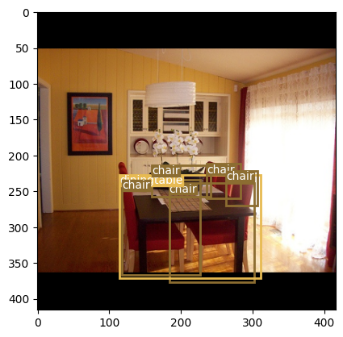

# Yolo v3

<a target="_blank" href="https://colab.research.google.com/github/Shilpaj1994/ERA/blob/master/Session13/yolov3.ipynb">
  
</a>

This repository contains following files:

- `config.py`: Configuration data for Yolo model training
- `dataset.py`: Contains dataset class to load the data and apply Mosaic 
- `loss.py`: Contains loss function as mentioned in the Yolo paper
- `model.py`: Contains building blocks of the Yolo network architecture
- `yolo_model.py`: Contains the PyTorch Lightning code for Yolov3
- `utils.py`: Contains utilities for model training
- `yolov3.ipynb`: Notebook with model training details and metrics


## Training Details

- The model was trained on [PASCAL VOC](https://www.kaggle.com/datasets/aladdinpersson/pascal-voc-dataset-used-in-yolov3-video) dataset

- Model is trained using Paperspace Gradient Notebook

-  Setup was done using `P5000` machine and training was done on `A4000`

- Dataset was downloaded using below command:

  ```bash
  $ kaggle datasets download -d aladdinpersson/pascal-voc-dataset-used-in-yolov3-video
  ```

  and extracted after changing zip file permission to 777

- The model is trained for 40 epochs using one cycle policy

- Model has used Mosaic technique to speed up the training part

- Below is the validation loss after training

  ```
  ┏━━━━━━━━━━━━━━━━━━━━━━━━━━━━━━┳━━━━━━━━━━━━━━━━━━━━━━━━━━━━━━┓
  ┃      Validate metric      ┃       DataLoader 0         ┃
  ┡━━━━━━━━━━━━━━━━━━━━━━━━━━━━━━╇━━━━━━━━━━━━━━━━━━━━━━━━━━━━━━┩
  │         val_loss          │     4.645358562469482      │
  └───────────────────────────┴────────────────────────────┘
  ```

- Below is the sample output after training

  


## Training Configuration

- `LearningRateMonitor` from PyTorch Lightning module is used to monitor learning rate during training
- `ModelCheckpoint` from PyTorch Lightning module is used to save the model during training based on the validation loss
- `ModelSummary` from PyTorch Lightning module is used to print the network summary
- `Trainer` from PyTorch Lightning module is used to train the model 

```python
# Monitor Learning rate while training to verify correct implementation of OCP
lr_monitor = LearningRateMonitor(logging_interval="epoch")

# Save the last best model based on validation loss
checkpoint_callback = ModelCheckpoint(
    save_top_k=1,
    verbose=True,
    monitor='val_loss',
    mode='min',
)

# Define trainer for model training
trainer = pl.Trainer(
    callbacks=[ModelSummary(max_depth=-1), lr_monitor, checkpoint_callback],
    max_epochs = 40,
    precision='16-mixed',
    check_val_every_n_epoch=1,
    num_sanity_val_steps=1
)

# Train the Model
trainer.fit(model)
```

- Training logs for last 5 epochs

```bash
Epoch: 35, Global Steps: 37260, Val Loss: 4.690880298614502
Epoch: 35, Global Steps: 37260, Train Loss: 3.954512596130371

Epoch: 36, Global Steps: 38295, Val Loss: 4.870270729064941
Epoch: 36, Global Steps: 38295, Train Loss: 3.8322622776031494

Epoch: 37, Global Steps: 39330, Val Loss: 4.869865417480469
Epoch: 37, Global Steps: 39330, Train Loss: 3.72934889793396

Epoch: 38, Global Steps: 40365, Val Loss: 4.847742080688477
Epoch: 38, Global Steps: 40365, Train Loss: 3.633148431777954

Epoch: 39, Global Steps: 41400, Val Loss: 4.52388334274292
Epoch: 39, Global Steps: 41400, Train Loss: 3.5980098247528076
```


---


## Gradio App


- An app is created to showcase the model output along the GradCam output
- App Link - https://huggingface.co/spaces/Shilpaj/yolo_v3
