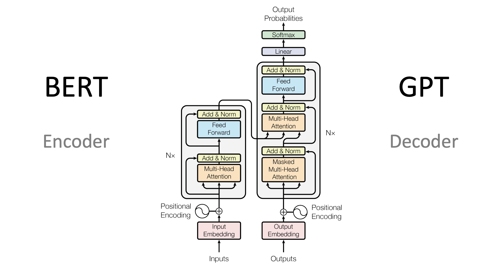
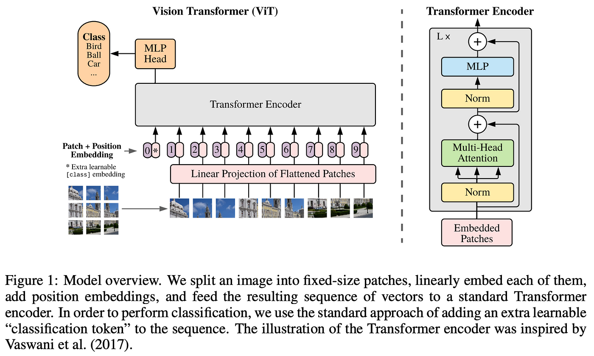

# BERT, GPT and ViT

- Transformer architecture consists of both encoder and decoder part
- Models like BARD includes both encoder and decoder part
- There are some models which follow the approch of having only either of the part
- BERT and ViT are both encoder only models
- GPT is decoder only model

## Transformer Architecture


- Transformer architecture are useful for both Natural Language Processing (NLP) and Computer Vision (CV) problems
- In the NLP domain, they overcome the LSTM's and RNN's limitation having small context and memory
- While in the Vision domain, they have higher receptive fields early on in the network layers
- The main components of the transformers are:
  - Attention
  - Multi-Head Attention
  - Embeddings
  - FeedForward Network
  - EncoderBlock and
  - DecoderBlock
- All the above-mentioned components are included in the `transformer.py`
- These are common components of any transformer based architectures:
  - Encoder only
  - Decoder only
  - Encoder-Decoder
- In this repo, these building blocks are used to create 3 different models - BERT, GPT and ViT
- These models are trained for specific tasks are details are mentioned below

---




## BERT
- Model is trained on poems of William Shakespeare
- The task of the model is to fill the blanks given a sentence from the dataset
- On training, the model understands the language and tries to pur appropriate word to complete the sentence
- Below are some training logs
```commandline
it: 9800  | loss 5.0  | Δw: 8.258
it: 9810  | loss 4.91  | Δw: 8.544
it: 9820  | loss 5.0  | Δw: 8.128
it: 9830  | loss 5.06  | Δw: 8.509
it: 9840  | loss 5.06  | Δw: 9.453
it: 9850  | loss 4.92  | Δw: 8.758
it: 9860  | loss 4.99  | Δw: 8.481
it: 9870  | loss 5.01  | Δw: 8.384
it: 9880  | loss 5.06  | Δw: 8.362
it: 9890  | loss 5.01  | Δw: 8.613
it: 9900  | loss 5.03  | Δw: 8.341
it: 9910  | loss 4.98  | Δw: 8.524
it: 9920  | loss 5.06  | Δw: 8.517
it: 9930  | loss 4.96  | Δw: 8.631
it: 9940  | loss 4.89  | Δw: 9.022
it: 9950  | loss 5.02  | Δw: 8.504
it: 9960  | loss 4.93  | Δw: 8.476
it: 9970  | loss 5.0  | Δw: 9.095
it: 9980  | loss 4.84  | Δw: 8.427
it: 9990  | loss 5.09  | Δw: 8.434
```

## GPT
- Model is trained on dataset which contains raw information of sessions
- Model is trained to generate output given some prompt
- On training, the model understands the language and tries to create sentences
- Below are some training logs
```commandline
step          0 | train loss 10.7165 | val loss 10.7144
step        499 | train loss 0.5163 | val loss 8.0840
```

## ViT

- It is an implementation of transformer architecture for the vision problems
- Similar to the paper, model is trained for the classification task
- Small dataset containing images of pizza, steak and sushi is used for training
- On training, the model is able to perform the classification task
- Below are some training logs
```commandline
Epoch: 1 | train_loss: 4.3024 | train_acc: 0.2422 | test_loss: 3.6144 | test_acc: 0.1979
Epoch: 2 | train_loss: 1.6759 | train_acc: 0.3086 | test_loss: 1.0321 | test_acc: 0.5417
Epoch: 3 | train_loss: 1.2004 | train_acc: 0.4102 | test_loss: 1.9045 | test_acc: 0.2604
```
