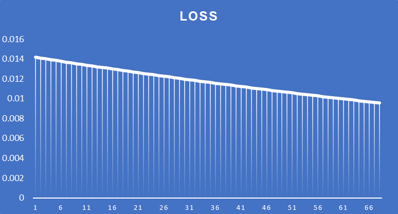

# Backpropagation

**BackProp in Python:** <a target="_blank" href="https://colab.research.google.com/github/Shilpaj1994/ERA/blob/master/Session6/BackProp.ipynb">
  
</a>

### 1.1 Introduction

- This article explains the functioning of Backpropagation algorithm and optimizer
- In a neural network, there are 3 types of layers
  - Input layer
  - Hidden layers
  - Output layer
- Generally, we have multiple hidden layers in neural network. Each layer consists of multiple neurons. There are weights associated with each neuron.
- For a fully connected layer, each neuron in the hidden layer has `n` number of weights associated with it. Where, `n` is the number of neurons in the previous layer
- For a convolutional layer, each kernel will have `length*width` number of weights associated with it.


### 1.2 Simple Neural Network 

- To explain the backpropagation for convolutional neural network is a tedious job, hence in this article it is done for a simple neural network with 2 hidden layers and 1 input layer
- Following is the representation of the neural network 


- In the above architecture,
  - `i1` and `i2` are the input neurons
  - `h1` and `h2` are the placeholders for the values calculated based on the weights and input data
  - `a_h1` and `a_h2` are the activations for `h1` and `h2`
  - w1, w2, w3, and w4 are the weights for the first hidden layer
  - `o1` and `o2` are the placeholders for the values calculated based on the weights and first hidden layer output data
  - `a_o1` and `a_o2` are the activations for `o1` and `o2`
  - w5, w6, w7, and w8 are the weights for the first hidden layer
  - `t1` and `t2` are the target values for the output from `a_o1` and `a_o2`
  - `E1` is the error value calculated using the target output and model output for `o1`
  - `E2` is the error value calculated using the target output and model output for `o2`


### 1.3 Data Flow Details

- The network receives the input data `i1` and `i2`. For this simple example, we have only one data sample

  ```python
  i1 = 0.5
  i2 = 0.05
  ```

- All the weights are initialized randomly and their values will update as we train the model

  ```python
  w1 = 0.15
  w2 = 0.2
  w3 = 0.25
  w4 = 0.3
  w5 = 0.4
  w6 = 0.45
  w7 = 0.5
  w8 = 0.55
  ```

- The values of the hidden layer neurons `h1` and `h2` are calculated based on the input values and the weights of the hidden layer. Similarly, values for the output layer neurons `o1` and `o2` are calculated based on output of hidden layers and the weights of the output layer.

  ```python
  # For Hidden Layer
  h1 = w1 * i1 + w2 * i2
  h2 = w3 * i1 + w4 * i2
  
  # For Output Layer
  o1 = w5 * a_h1 + w6 * a_h2
  o2 = w7 * a_h1 + w8 * a_h2
  ```

- The above equations are linear in nature. In order to introduce a non-linearity, activation functions are applied in each layer. For this example, sigmoid function is used as an activation function

  

- The output of activation function for hidden layer and output layer is calculated using the following equations

  ```python
  # For Hidden Layer
  a_h1 = sigmoid(h1) = 1 / (1 + exp(-h1))
  a_h2 = sigmoid(h2) = 1 / (1 + exp(-h2))
  
  # For Output Layer
  a_o1 = sigmoid(o1) = 1 / (1 + exp(-o1))
  a_o2 = sigmoid(o2) = 1 / (1 + exp(-o2))
  ```

- Now that all the equations are in place, the data flow can be summarized as:

  Inputs     >  Hidden layer Neuron > Activation of hidden layer > output layer > activation of output layer

  `i1`, `i2`   >                `h1`,` h2`             >             `a_h1`, `a_h2`             >       `o1`, `o2`    >             `a_o1`, `a_o2`

- The expected output or the target output for the input values are `a_o1` = `t1`  and `a_o2` = `t2`. In this case both are 0.5

  But, the values after calculations are `a_o1` = 0.6064 and `a_o2` = 0.5342

- Hence, we have to calculate the error `E1` and `E2` for `a_o1` and `a_o2` respectively

  ```python
  E1 = 1/2 * (t1 - a_o1)**2
  E2 = 1/2 * (t2 - a_o1)**2
  ```

  Here, values are multiplied by 0.5 to make the calculations easier

- The total error for one epoch or in this case, one sample of input, is the sum of `E1` and `E2`

  ```python
  E_total = E1 + E2
  ```

  

### 1.4 Gradient Calculations

- Now that we have error values for a sample input, we need to do some changes to minimize the error

- At a higher level, the error is dependent on the input values and the weights

- We cannot change the input to the network, hence we need to adjust the weights such that model start predicting correct output values

- We cannot change the weights randomly, they need to be modified in a systematic manner. From the above equations, it is clear that the change in hidden layer weight will affect the output of the activate neuron of output layer and thus the error.

- All the weights are connected in a chained fashion that is changing one will change the outputs of all the succeeding values in the chain

- But again - we cannot change the values of the weights randomly, we need to know how much each weight is affecting the output. Hence we need to change the weights based on the error values

- Backpropagation is used to calculate the gradients i.e. by how much value, each weight should be changed in order to minimize the error

- We need to understand how sensitive is the cost function (E_total) to the changes in the weights i.e. derivate of `E_total` with respect to weights

- Let's start with calculating gradients for the weights of the output layer since it is closest to the output

  ```text
  ∂E_total/∂w5 = ∂(E1 + E2)/∂w5
  ∂E_total/∂w5 = ∂E1/∂w5
  ```

- The change in `w5` will cause some change `o1`, which causes some changes to `a_o1` which directly influences the cost

- The sensitivity of `E_total` to small changes in `w5` can be calculated by using chain rule

  ```text
  ∂E_total/∂w5 = ∂E1/∂w5 = ∂E1/∂a_o1*∂a_o1/∂o1*∂o1/∂w5					
  ```

- After calculating the derivates, the values are:

  ```
  ∂E1/∂a_o1 =  ∂(½ * (t1 - a_o1)²)/∂a_o1 = (a_01 - t1)					
  ∂a_o1/∂o1 =  ∂(σ(o1))/∂o1 = a_o1 * (1 - a_o1)					
  ∂o1/∂w5 = a_h1					
  ```

  and thus the sensitivity of `E_total` to small change in `w5` is given by:

  ```
  ∂E_total/∂w5 = (a_01 - t1) * a_o1 * (1 - a_o1) *  a_h1					
  ```

- Similarly, the sensitivity of `E_total` to small change in `w6`, `w7` and `w8` is given by:

  ```latex
  ∂E_total/∂w6 = (a_01 - t1) * a_o1 * (1 - a_o1) *  a_h2					
  ∂E_total/∂w7 = (a_02 - t2) * a_o2 * (1 - a_o2) *  a_h1					
  ∂E_total/∂w8 = (a_02 - t2) * a_o2 * (1 - a_o2) *  a_h2					
  ```

- Similarly, to calculate the sensitivity of `E_total` to small change in `w1`, `w2`, `w3`, and `w4`, first we need to calculate it with respect to `a_h1` and `a_h2`

  ```
  ∂E1/∂a_h1 = (a_01 - t1) * a_o1 * (1 - a_o1) * w5								
  ∂E2/∂a_h1 = (a_02 - t2) * a_o2 * (1 - a_o2) * w7								
  ∂E_total/∂a_h1 = (a_01 - t1) * a_o1 * (1 - a_o1) * w5 +  (a_02 - t2) * a_o2 * (1 - a_o2) * w7			
  ∂E_total/∂a_h2 = (a_01 - t1) * a_o1 * (1 - a_o1) * w6 +  (a_02 - t2) * a_o2 * (1 - a_o2) * w8			
  ```

  Now, we can go further inside the network, to calculate with respect to weights

  ```
  ∂E_total/∂w1 = ∂E_total/∂a_h1 * ∂a_h1/∂h1 * ∂h1/∂w1					
  ∂E_total/∂w2 = ∂E_total/∂a_h1 * ∂a_h1/∂h1 * ∂h1/∂w2					
  ∂E_total/∂w3 = ∂E_total/∂a_h2 * ∂a_h2/∂h2 * ∂h2/∂w3
  ∂E_total/∂w4 = ∂E_total/∂a_h2 * ∂a_h2/∂h2 * ∂h2/∂w4
  ```

  Substituting above values:

  ```
  ∂E_total/∂w1 = ((a_01 - t1) * a_o1 * (1 - a_o1) * w5 +  (a_02 - t2) * a_o2 * (1 - a_o2) * w7) * a_h1 * (1 - a_h1) * i1												
  ∂E_total/∂w2 = ((a_01 - t1) * a_o1 * (1 - a_o1) * w5 +  (a_02 - t2) * a_o2 * (1 - a_o2) * w7) * a_h1 * (1 - a_h1) * i2												
  ∂E_total/∂w3 = ((a_01 - t1) * a_o1 * (1 - a_o1) * w6 +  (a_02 - t2) * a_o2 * (1 - a_o2) * w8) * a_h2 * (1 - a_h2) * i1												
  ∂E_total/∂w4 = ((a_01 - t1) * a_o1 * (1 - a_o1) * w6 +  (a_02 - t2) * a_o2 * (1 - a_o2) * w8) * a_h2 * (1 - a_h2) * i2												
  ```

- Finally, sensitivity of E_total to small change in all the weights is given by:

  ```
  ∂E_total/∂w1 = ((a_01 - t1) * a_o1 * (1 - a_o1) * w5 +  (a_02 - t2) * a_o2 * (1 - a_o2) * w7) * a_h1 * (1 - a_h1) * i1												
  ∂E_total/∂w2 = ((a_01 - t1) * a_o1 * (1 - a_o1) * w5 +  (a_02 - t2) * a_o2 * (1 - a_o2) * w7) * a_h1 * (1 - a_h1) * i2												
  ∂E_total/∂w3 = ((a_01 - t1) * a_o1 * (1 - a_o1) * w6 +  (a_02 - t2) * a_o2 * (1 - a_o2) * w8) * a_h2 * (1 - a_h2) * i1												
  ∂E_total/∂w4 = ((a_01 - t1) * a_o1 * (1 - a_o1) * w6 +  (a_02 - t2) * a_o2 * (1 - a_o2) * w8) * a_h2 * (1 - a_h2) * i2	
  ∂E_total/∂w5 = (a_01 - t1) * a_o1 * (1 - a_o1) *  a_h1					
  ∂E_total/∂w6 = (a_01 - t1) * a_o1 * (1 - a_o1) *  a_h2					
  ∂E_total/∂w7 = (a_02 - t2) * a_o2 * (1 - a_o2) *  a_h1					
  ∂E_total/∂w8 = (a_02 - t2) * a_o2 * (1 - a_o2) *  a_h2					
  ```

- This is a the first step to train the model. Once the gradients are calculated, we can update the weights and check if the loss is decreasing i.e. model is learning. These calculations are added in the excel sheet. After substituting the values, following are the numeric values of the gradients for each weight 

  | t1   | t2   | i1   | i2   | w1   | w2   | w3   | w4   | h1     | a_h1        | h2     | a_h2        | w5   | w6   | w7   | w8   | o1          | a_o1        | o2          | a_o2        | E1          | E2          | E_tot       | ∂E/∂w1      | ∂E/∂w2      | ∂E/∂w3      | ∂E/∂w4      | ∂E/∂w5      | ∂E/∂w6      | ∂E/∂w7      | ∂E/∂w8      |
  | ---- | ---- | ---- | ---- | ---- | ---- | ---- | ---- | ------ | ----------- | ------ | ----------- | ---- | ---- | ---- | ---- | ----------- | ----------- | ----------- | ----------- | ----------- | ----------- | ----------- | ----------- | ----------- | ----------- | ----------- | ----------- | ----------- | ----------- | ----------- |
  | 0.5  | 0.5  | 0.05 | 0.1  | 0.15 | 0.2  | 0.25 | 0.3  | 0.0275 | 0.506874567 | 0.0425 | 0.510623401 | 0.4  | 0.45 | 0.5  | 0.55 | 0.432530357 | 0.606477732 | 0.534280154 | 0.630480835 | 0.005668754 | 0.008512624 | 0.014181378 | 0.000316993 | 0.000633987 | 0.000351869 | 0.000703737 | 0.012880819 | 0.012976085 | 0.015408348 | 0.015522308 |


### 1.5 Weight Update

- The optimizer takes these gradients and update the weights

- In this case, we will use a simple equation to update the weights

  ```
  Updated weights = weights - Learning rate * gradients for the weight
  ```

- Let's calculate it for the `w1`

  `w1_updated` = `w1` - learning_rate * gradients for w1

  Here, the learning rate is set as 1.

  ```
  w1_updated = 0.15 - 1 * 0.00031
  w1_updated = 0.14968
  ```

- Similarly, all the weights are updated and then gradients are calculated step is repeated based on the updated weights

- After updating all the weights, error is calculated and it is reduced from 0.01418 to 0.01337

| t1   | t2   | i1   | i2   | w1          | w2          | w3          | w4          | h1          | a_h1        | h2          | a_h2        | w5          | w6          | w7          | w8          | o1          | a_o1        | o2          | a_o2        | E1          | E2          | E_tot       | ∂E/∂w1      | ∂E/∂w2      | ∂E/∂w3      | ∂E/∂w4      | ∂E/∂w5      | ∂E/∂w6      | ∂E/∂w7      | ∂E/∂w8      |
| ---- | ---- | ---- | ---- | ----------- | ----------- | ----------- | ----------- | ----------- | ----------- | ----------- | ----------- | ----------- | ----------- | ----------- | ----------- | ----------- | ----------- | ----------- | ----------- | ----------- | ----------- | ----------- | ----------- | ----------- | ----------- | ----------- | ----------- | ----------- | ----------- | ----------- |
| 0.5  | 0.5  | 0.05 | 0.1  | 0.15        | 0.2         | 0.25        | 0.3         | 0.0275      | 0.506874567 | 0.0425      | 0.510623401 | 0.4         | 0.45        | 0.5         | 0.55        | 0.432530357 | 0.606477732 | 0.534280154 | 0.630480835 | 0.005668754 | 0.008512624 | 0.014181378 | 0.000316993 | 0.000633987 | 0.000351869 | 0.000703737 | 0.012880819 | 0.012976085 | 0.015408348 | 0.015522308 |
| 0.5  | 0.5  | 0.05 | 0.1  | 0.149683007 | 0.199366013 | 0.249648131 | 0.299296263 | 0.027420752 | 0.506854758 | 0.042412033 | 0.510601419 | 0.387119181 | 0.437023915 | 0.484591652 | 0.534477692 | 0.41935823  | 0.60332967  | 0.518522653 | 0.626802248 | 0.00533851  | 0.008039405 | 0.013377915 | 0.000299281 | 0.000598562 | 0.000333197 | 0.000666394 | 0.012534095 | 0.012626746 | 0.01503419  | 0.015145323 |

- Since we are passing only one sample, we can call it as an epoch and above are the calculations done in 2 epochs
- In the excel sheet, calculations are written for 68 epochs and the loss is plotted


​		This is how the loss is reduced for 68 epochs with a learning rate of 1

- Following is how the loss is reduced for different learning rates

  | Learning Rate | Graph                                                        |
  | ------------- | ------------------------------------------------------------ |
  | 0.1           |  |
  | 0.2           |  |
  | 0.5           |  |
  | 0.8           |  |
  | 1.0           |  |
  | 2.0           |  |
  | 1000.0        |  |

  

- As shown in the graphs, as the learning rate increases, the model is converging quicker since the loss is reducing quickly

- But when the learning rate is increased beyond the a certain value, the model is not able to converge and hence the loss value is not decreasing

- This is how backpropagation and optimizer algorithms works to train the model

- In the PyTorch, `train_loss.backward()` is used to calculate all the gradients and `optimizer.step()` is used to update all the weights while training the mode


---


# Code Details

This section contains detail information about on the file contents 


### 2.1 model.py

- This script contains the definition of a neural network model architecture
- It includes the implementation of the `Network` class, which defines the structure of the neural network.

```python
class Network(Module):
    """
    Increasing number of channels with each block strategy for the model
    """
    def __init__(self):
        """
        Constructor
        """
        # Convolution Block-1
        super(Network, self).__init__()
        # Input - 28    Output - 26    Receptive Field - 3
        self.conv1 = nn.Conv2d(in_channels=1, out_channels=16, kernel_size=3, bias=False)    
        self.batch_norm1 = nn.BatchNorm2d(16)
        # Input - 26    Output - 24    Receptive Field - 5
        self.conv2 = nn.Conv2d(in_channels=16, out_channels=16, kernel_size=3, bias=False)   
        self.batch_norm2 = nn.BatchNorm2d(16)
        # Input - 24    Output - 22    Receptive Field - 7
        self.conv3 = nn.Conv2d(in_channels=16, out_channels=16, kernel_size=3, bias=False)   
        self.batch_norm3 = nn.BatchNorm2d(16)
        # Input - 22    Output - 20    Receptive Field - 9
        self.conv4 = nn.Conv2d(in_channels=16, out_channels=16, kernel_size=3, bias=False)   
        self.batch_norm4 = nn.BatchNorm2d(16)

        # Transition-1
        # Input - 20    Output - 20    Receptive Field - 9
        self.point_1 = nn.Conv2d(in_channels=16, out_channels=12, kernel_size=1, bias=False)  
        self.batch_norm_point1 = nn.BatchNorm2d(12)
        # Input - 20    Output - 10    Receptive Field - 10
        self.max_pool1 = nn.MaxPool2d(kernel_size=2, stride=2)                                

        # Convolution Block-2
        # Input - 10    Output - 8   Receptive Field - 14
        self.conv5 = nn.Conv2d(in_channels=12, out_channels=20, kernel_size=3, bias=False)  
        self.batch_norm5 = nn.BatchNorm2d(20)
        # Input - 8    Output - 6    Receptive Field - 18
        self.conv6 = nn.Conv2d(in_channels=20, out_channels=20, kernel_size=3, bias=False)  
        self.batch_norm6 = nn.BatchNorm2d(20)
        # Input - 6    Output - 4    Receptive Field - 22
        self.conv7 = nn.Conv2d(in_channels=20, out_channels=20, kernel_size=3, bias=False)  
        self.batch_norm7 = nn.BatchNorm2d(20)
        # Input - 4    Output - 2    Receptive Field - 26
        self.conv8 = nn.Conv2d(in_channels=20, out_channels=16, kernel_size=3, bias=False)  
        self.batch_norm8 = nn.BatchNorm2d(16)

        # Transition-2
        # Input - 2    Output - 2    Receptive Field - 26
        self.point_2 = nn.Conv2d(in_channels=16, out_channels=10, kernel_size=1, bias=False)  
        self.batch_norm_point2 = nn.BatchNorm2d(10)
		# Input - 2    Output - 1    Receptive Field - 28
        self.gap = nn.AvgPool2d(2)                                                            
        self.dropout = nn.Dropout(0.01)

    def forward(self, x):
        """
        Forward Pass
        """
        # Convolution Block-1
        x = F.relu(self.conv1(x))
        x = self.batch_norm1(self.dropout(x))

        x = F.relu(self.conv2(x))
        x = self.batch_norm2(self.dropout(x))

        x = F.relu(self.conv3(x))
        x = self.batch_norm3(self.dropout(x))

        x = F.relu(self.conv4(x))
        x = self.batch_norm4(self.dropout(x))

        # Transition Block-1
        x = self.max_pool1(F.relu(self.point_1(x)))
        x = self.batch_norm_point1(self.dropout(x))

        # Convolution Block-2
        x = F.relu(self.conv5(x))
        x = self.batch_norm5(self.dropout(x))

        x = F.relu(self.conv6(x))
        x = self.batch_norm6(self.dropout(x))

        x = F.relu(self.conv7(x))
        x = self.batch_norm7(self.dropout(x))

        x = F.relu(self.conv8(x))
        x = self.batch_norm8(self.dropout(x))

        # Transition Block-2
        x = F.relu(self.point_2(x))
        x = self.batch_norm_point2(self.dropout(x))

        x = self.gap(x)

        x = x.view(-1, 10)
        return F.log_softmax(x, dim=0)
```

- The `Network` class inherits from the `nn.Module` class provided by PyTorch and represents a convolutional neural network (CNN) architecture. The architecture consists of several layers, including convolutional layers, dropout layer, global average pooling layer.
- The `Network()` class is a child class of `nn.Module`
- `super(Network, self).__init__()` will inherit all the properties of `nn.Module` to our class
- Four convolutional and two fully connected layers are defined in the constructor
- The `forward(self, x)` method defines the forward pass for model training
- It takes an input tensor `x` and applies the defined layers to compute the output of the model
- The activation function used between the layers is the rectified linear unit (ReLU). The output is passed through a log softmax function to obtain the final magnitude of each class
- The receptive field of the network is 28
- The model has a total of 19,972 parameters


### 2.2 utils.py

This script contains utility functions that can be used for training a model. It includes functions for model summary, displaying loss and accuracies, displaying data samples, and training/testing the model.


#### get summary

- This function prints the summary of the model architecture
- It takes an object of the model architecture and the input data shape as input parameters.

```python
def get_summary(model: object, input_size: tuple):
    """
    Function to get the summary of the model architecture
    :param model: Object of model architecture class
    :param input_size:
    :return:
    """
    use_cuda = torch.cuda.is_available()
    device = torch.device("cuda" if use_cuda else "cpu")
    network = model.to(device)
    summary(network, input_size=input_size)
```


#### display loss and accuracies

- This function displays the training and test information such as losses and accuracies
- It takes lists containing training losses, training accuracies, test losses, and test accuracies as input parameters
- Additionally, it accepts an optional parameter `plot_size` to specify the size of the plot.

```python
def display_loss_and_accuracies(train_losses: list, train_acc: list, test_losses: list, test_acc: list) -> NoReturn:
    """
    Function to display training and test losses and accuracies
    :param train_losses: training loss
    :param train_acc: training accuracy
    :param test_losses: test loss
    :param test_acc: test accuracy
    """
    fig, axs = plt.subplots(2, 2, figsize=(15, 10))

    axs[0, 0].plot(train_losses)
    axs[0, 0].set_title("Training Loss")

    axs[1, 0].plot(train_acc)
    axs[1, 0].set_title("Training Accuracy")

    axs[0, 1].plot(test_losses)
    axs[0, 1].set_title("Test Loss")

    axs[1, 1].plot(test_acc)
    axs[1, 1].set_title("Test Accuracy")
```


#### GetCorrectPredCount

- This function returns the total number of correct predictions
- It takes model predictions and correct labels of a given sample of data as input parameters and returns the number of correct predictions.

```python
def GetCorrectPredCount(pPrediction, pLabels):
    """
    Function to return total number of correct predictions
    :param pPredictions: Model predictions on a given sample of data
    :param pLabels: Correct labels of a given sample of data
    """
    return pPrediction.argmax(dim=1).eq(pLabels).sum().item()
```


#### train

- This function is used to train the model on the training dataset
- It takes the model architecture, device (GPU or CPU), training data loader, optimizer, and loss criterion as input parameters
- It returns the number of correct predictions, the number of processed samples, and the total training loss

```python
def train(model, device, train_loader, optimizer, criterion):
    """
    Function to train model on the training dataset
    :param model: Model architecture
    :param device: Device on which training is to be done (GPU/CPU)
    :param train_loader: DataLoader for training dataset
    :param optimizer: Optimization algorithm to be used for updating weights
    """
    model.train()
    pbar = tqdm(train_loader)

    train_loss = 0
    correct = 0
    processed = 0

    for batch_idx, (data, target) in enumerate(pbar):
        data, target = data.to(device), target.to(device)
        optimizer.zero_grad()

        # Predict
        pred = model(data)

        # Calculate loss
        loss = criterion(pred, target)
        train_loss += loss.item()

        # Backpropagation
        loss.backward()
        optimizer.step()

        correct += GetCorrectPredCount(pred, target)
        processed += len(data)

        pbar.set_description(
            desc=f'Train: Loss={loss.item():0.4f} Batch_id={batch_idx} Accuracy={100 * correct / processed:0.2f}')

    return correct, processed, train_loss
```


#### test

- This function is used to test the model's training progress on the test dataset
- It takes the model architecture, device (GPU or CPU), test data loader, and loss criterion as input parameters
- It returns the number of correct predictions and the average test loss

```python
def test(model, device, test_loader, criterion):
    """
    Function to test the model training progress on the test dataset
    :param model: Model architecture
    :param device: Device on which training is to be done (GPU/CPU)
    :param test_loader: DataLoader for test dataset
    """
    model.eval()

    test_loss = 0
    correct = 0

    with torch.no_grad():
        for batch_idx, (data, target) in enumerate(test_loader):
            data, target = data.to(device), target.to(device)

            output = model(data)
            test_loss += criterion(output, target, reduction='sum').item()  # sum up batch loss

            correct += GetCorrectPredCount(output, target)

    test_loss /= len(test_loader.dataset)

    print('Test set: Average loss: {:.4f}, Accuracy: {}/{} ({:.2f}%)\n'.format(
        test_loss, correct, len(test_loader.dataset),
        100. * correct / len(test_loader.dataset)))

    return correct, test_loss
```


### 2.3 S6.ipynb

This file contains code for training and evaluating a neural network model on the MNIST dataset. The code is divided into several code blocks, each serving a specific purpose. Below is an overview of each code block:

#### Code Block 1 - Importing Required Modules

- In this code block, the necessary modules for the project are imported. These include `sys`, `torch`, `torch.nn`, `torch.nn.functional`, `torch.optim`, and `torchvision`.

- If the code is being executed in Google Colab, the repository is downloaded from GitHub, and the required files are imported.

```python
# Import all the required modules
import sys
import torch
import torch.nn as nn
import torch.nn.functional as F
import torch.optim as optim
from torchvision import datasets, transforms

if 'google.colab' in sys.modules:
    # Download the repo from GitHub
    print("Downloading repository on Colab...")
    !git clone https://github.com/Shilpaj1994/ERA.git
    
    # Import files from the downloaded repository
    sys.path.insert(0,'./ERA/Session6/')
```


#### Code Block 2 - Checking GPU Availability

- This code block checks if a GPU is available and sets the device accordingly
- If a GPU is available, the device is set to "cuda"; otherwise, it is set to "cpu".

```python
# Check if GPU is available
# Set device as GPU if available else CPU
cuda = torch.cuda.is_available()
print("CUDA Available?", cuda)
device = torch.device("cuda" if torch.cuda.is_available() else "cpu")
```


#### Code Block 3 - Data Transformations

- This code block defines the transformations to be applied to the training and test data
- The transformations include random cropping, resizing, random rotation, tensor conversion, and normalization.

```python
# Train data transformations
train_transforms = transforms.Compose([
    transforms.RandomApply([transforms.CenterCrop(22), ], p=0.1),
    transforms.Resize((28, 28)),
    transforms.RandomRotation((-15., 15.), fill=0),
    transforms.ToTensor(),
    transforms.Normalize((0.1307,), (0.3081,)),
    ])

# Test data transformations
test_transforms = transforms.Compose([
    transforms.ToTensor(),
    transforms.Normalize((0.1325,), (0.3104,))
    ])
```


#### Code Block 4 - Loading the Dataset

- In this code block, the MNIST dataset is downloaded and loaded using the `datasets.MNIST` class from torchvision
- The dataset is divided into training and test sets, and the defined transformations are applied
- This block performs the extract and transform part of the data pipeline

```python
train_data = datasets.MNIST('../data', train=True, download=True, transform=train_transforms)
test_data = datasets.MNIST('../data', train=False, download=True, transform=test_transforms)
```


#### Code Block 5 - Creating Data Loaders

- Data loaders are created for both the training and test datasets using `torch.utils.data.DataLoader`
- The loaders handle batching, shuffling, and parallel data loading.

```python
batch_size = 512

kwargs = {'batch_size': batch_size, 'shuffle': True, 'num_workers': 2, 'pin_memory': True}

test_loader = torch.utils.data.DataLoader(test_data, **kwargs)
train_loader = torch.utils.data.DataLoader(train_data, **kwargs)
```


#### Code Block 6 - Visualizing Sample Data

This code block visualizes a batch of sample images and their corresponding labels using matplotlib.

```python
import matplotlib.pyplot as plt

batch_data, batch_label = next(iter(train_loader)) 

fig = plt.figure()

for i in range(12):
  plt.subplot(3,4,i+1)
  plt.tight_layout()
  plt.imshow(batch_data[i].squeeze(0), cmap='gray')
  plt.title(batch_label[i].item())
  plt.xticks([])
  plt.yticks([])
```


#### Code Block 7 - Importing the Model

The model architecture is imported from the `model` file.

```python
from model import Network
```

The `get_summary` function from the `utils` module is used to print a summary of the model architecture.

```python
# Model Summary
from utils import get_summary

get_summary(Network(), (1, 28, 28))
```

```bash
----------------------------------------------------------------
        Layer (type)               Output Shape         Param #
================================================================
            Conv2d-1           [-1, 16, 26, 26]             144
           Dropout-2           [-1, 16, 26, 26]               0
       BatchNorm2d-3           [-1, 16, 26, 26]              32
            Conv2d-4           [-1, 16, 24, 24]           2,304
           Dropout-5           [-1, 16, 24, 24]               0
       BatchNorm2d-6           [-1, 16, 24, 24]              32
            Conv2d-7           [-1, 16, 22, 22]           2,304
           Dropout-8           [-1, 16, 22, 22]               0
       BatchNorm2d-9           [-1, 16, 22, 22]              32
           Conv2d-10           [-1, 16, 20, 20]           2,304
          Dropout-11           [-1, 16, 20, 20]               0
      BatchNorm2d-12           [-1, 16, 20, 20]              32
           Conv2d-13           [-1, 12, 20, 20]             192
        MaxPool2d-14           [-1, 12, 10, 10]               0
          Dropout-15           [-1, 12, 10, 10]               0
      BatchNorm2d-16           [-1, 12, 10, 10]              24
           Conv2d-17             [-1, 20, 8, 8]           2,160
          Dropout-18             [-1, 20, 8, 8]               0
      BatchNorm2d-19             [-1, 20, 8, 8]              40
           Conv2d-20             [-1, 20, 6, 6]           3,600
          Dropout-21             [-1, 20, 6, 6]               0
      BatchNorm2d-22             [-1, 20, 6, 6]              40
           Conv2d-23             [-1, 20, 4, 4]           3,600
          Dropout-24             [-1, 20, 4, 4]               0
      BatchNorm2d-25             [-1, 20, 4, 4]              40
           Conv2d-26             [-1, 16, 2, 2]           2,880
          Dropout-27             [-1, 16, 2, 2]               0
      BatchNorm2d-28             [-1, 16, 2, 2]              32
           Conv2d-29             [-1, 10, 2, 2]             160
          Dropout-30             [-1, 10, 2, 2]               0
      BatchNorm2d-31             [-1, 10, 2, 2]              20
        AvgPool2d-32             [-1, 10, 1, 1]               0
================================================================
Total params: 19,972
Trainable params: 19,972
Non-trainable params: 0
----------------------------------------------------------------
Input size (MB): 0.00
Forward/backward pass size (MB): 0.90
Params size (MB): 0.08
Estimated Total Size (MB): 0.98
----------------------------------------------------------------
```


#### Code Block 8 - Initializing Variables for Accuracy and Loss Graphs

Empty lists are initialized to store the training and test losses, as well as the training and test accuracies. Additionally, a dictionary is created to store incorrectly predicted samples during testing.

```python
# Data to plot accuracy and loss graphs
train_losses = []
test_losses = []
train_acc = []
test_acc = []

test_incorrect_pred = {'images': [], 'ground_truths': [], 'predicted_vals': []}
```


#### Code Block 9 - Importing Utility Functions

Utility functions for training and testing the model are imported from the `utils` file.

```python
from utils import train, test
```


#### Code Block 10 - Model Training and Evaluation

- In this code block, the model is trained and evaluated
- The model is instantiated, an optimization algorithm (SGD) is defined, and a learning rate scheduler is set
- The criterion for loss calculation is defined as the negative log-likelihood loss.
- The training loop runs for a specified number of epochs
- In each epoch, the model is trained on the training dataset, and the training loss and accuracy are recorded
- Then, the model's performance is evaluated on the test dataset, and the test loss and accuracy are recorded
- The learning rate scheduler is also updated after specific number of epochs

```python
# Put the model on selected device
model = Network().to(device)

# Optimization algorithm to update the weights
optimizer = optim.SGD(model.parameters(), lr=0.01, momentum=0.9)

# Scheduler to change the learning rate after specific number of epochs
scheduler = optim.lr_scheduler.StepLR(optimizer, step_size=15, gamma=0.1, verbose=True)

# New Line
criterion = F.nll_loss

# Number of epochs for which model is to be trained
num_epochs = 20

# For each epoch
for epoch in range(1, num_epochs+1):
    print(f'Epoch {epoch}')

    # Train the model on training dataset and append the training loss and accuracy
    correct, processed, train_loss = train(model, device, train_loader, optimizer, criterion)
    train_acc.append(100 * correct / processed)
    train_losses.append(train_loss / len(train_loader))

    # Test the model's performance on test dataset and append the training loss and accuracy
    correct, test_loss = test(model, device, test_loader, criterion)
    test_acc.append(100. * correct / len(test_loader.dataset))
    test_losses.append(test_loss)
    
    # Update the learning rate after specified number of epochs
    scheduler.step()
```


#### Code Block 11 - Displaying Loss and Accuracy

This code block uses the `display_loss_and_accuracies` function from the `utils` module to plot the training and test loss curves and display the training and test accuracies.

```python
# Print loss and accuracy
from utils import display_loss_and_accuracies
display_loss_and_accuracies(train_losses, train_acc, test_losses, test_acc)
```


This code provides a complete pipeline for training and evaluating a neural network model on the MNIST dataset. It can be used as a starting point for developing and experimenting with different architectures and training strategies. Feel free to modify the code to suit your specific needs.


---


## 3. Run

### 3.1 Run on Colab

<a target="_blank" href="https://colab.research.google.com/github/Shilpaj1994/ERA/blob/master/Session6/S6.ipynb">
  
</a>

- Click on the above button to open the notebook and Colab and execute the code
- Make a copy of this file in your Google Colab to ensure your changes are saved


### 3.2 Run on Local System

- Open Jupyterlab

  ```bash
  $ jupyter-lab
  ```

- Open and run the notebook

