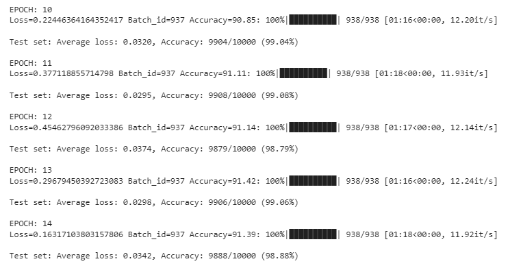

# Model Training

### Problem Statement:

- Achieve 99.4 % test accuracy on MNIST
- Achieve it under 15 epochs
- Achieve it under 8000 parameters


## Code-1: The Setup

### Target:
- Get the set-up right
- Set Extract, Transform and Load pipeline
- Visualize the transformed images
- Set Data Loader
- Set Basic Working Code
- Set Basic Training  & Test Loop

### Results:
- Parameters: 6.3M
- Best Training Accuracy: 98.72
- Best Test Accuracy: 99.29

```python
----------------------------------------------------------------
        Layer (type)               Output Shape         Param #
================================================================
            Conv2d-1           [-1, 32, 28, 28]             320
            Conv2d-2           [-1, 64, 28, 28]          18,496
         MaxPool2d-3           [-1, 64, 14, 14]               0
            Conv2d-4          [-1, 128, 14, 14]          73,856
            Conv2d-5          [-1, 256, 14, 14]         295,168
         MaxPool2d-6            [-1, 256, 7, 7]               0
            Conv2d-7            [-1, 512, 5, 5]       1,180,160
            Conv2d-8           [-1, 1024, 3, 3]       4,719,616
            Conv2d-9             [-1, 10, 1, 1]          92,170
================================================================
Total params: 6,379,786
Trainable params: 6,379,786
Non-trainable params: 0
----------------------------------------------------------------
Input size (MB): 0.00
Forward/backward pass size (MB): 1.51
Params size (MB): 24.34
Estimated Total Size (MB): 25.85
----------------------------------------------------------------
```


### Analysis:
- Extremely Heavy Model for such a problem
- Basic setup is completed
- Only basic augmentations is done
- Need to change the model


---


## Code-2: The Skeleton

### Target:

- Get the basic model skeleton right. I have to avoid changing this skeleton as much as possible
- No fancy stuff
- No BatchNorm layers, No Dropout, No Padding
- Use squeeze and expand kind of model architecture
- At least get 99% on test data

### Results:

- Parameters: 261K
- Best Training Accuracy: 98.49
- Best Test Accuracy: 99.02

```python
----------------------------------------------------------------
        Layer (type)               Output Shape         Param #
================================================================
            Conv2d-1           [-1, 32, 26, 26]             288
            Conv2d-2           [-1, 64, 24, 24]          18,432
            Conv2d-3          [-1, 128, 22, 22]          73,728
         MaxPool2d-4          [-1, 128, 11, 11]               0
            Conv2d-5             [-1, 32, 9, 9]          36,864
            Conv2d-6             [-1, 64, 7, 7]          18,432
            Conv2d-7            [-1, 128, 5, 5]          73,728
            Conv2d-8             [-1, 32, 3, 3]          36,864
            Conv2d-9             [-1, 10, 1, 1]           2,880
================================================================
Total params: 261,216
Trainable params: 261,216
Non-trainable params: 0
----------------------------------------------------------------
Input size (MB): 0.00
Forward/backward pass size (MB): 1.11
Params size (MB): 1.00
Estimated Total Size (MB): 2.11
----------------------------------------------------------------
```


### Analysis:

- The model is working but the number of parameters are still large
- Test accuracy is higher than training accuracy which shows that the model has the potential to reach the target


---


## Code-3: The Lighter Model

### Target:

- Reduce the number of parameters in the model and finalize the architecture which can achieve good results with lesser parameters

### Results:

- Parameters: 13.7K
- Best Training Accuracy: 97.34
- Best Test Accuracy: 98.58

```python
----------------------------------------------------------------
        Layer (type)               Output Shape         Param #
================================================================
            Conv2d-1           [-1, 12, 26, 26]             108
            Conv2d-2           [-1, 16, 24, 24]           1,728
            Conv2d-3           [-1, 18, 22, 22]           2,592
            Conv2d-4           [-1, 12, 20, 20]           1,944
         MaxPool2d-5           [-1, 12, 10, 10]               0
            Conv2d-6             [-1, 16, 8, 8]           1,728
            Conv2d-7             [-1, 18, 6, 6]           2,592
            Conv2d-8             [-1, 12, 4, 4]           1,944
            Conv2d-9             [-1, 12, 2, 2]           1,296
           Conv2d-10             [-1, 10, 1, 1]             480
================================================================
Total params: 14,412
Trainable params: 14,412
Non-trainable params: 0
----------------------------------------------------------------
Input size (MB): 0.00
Forward/backward pass size (MB): 0.26
Params size (MB): 0.05
Estimated Total Size (MB): 0.32
----------------------------------------------------------------
```


### Analysis:

- The model performed terribly after reducing the number of parameters
- Hence, the architecture was modified by shifting a layer from block 2 to block1
- The receptive field of the model is increased to 30
- The model still has potential since the test accuracy is better than the training accuracy


---


## Code-4: The Batch Normalization

### Target:

- Add Batch Normalization to increase the model efficiency

### Results:

- Parameters: 13.9K

- Best Training Accuracy: 99.24

- Best Test Accuracy: 99.53

  ```python
  ----------------------------------------------------------------
          Layer (type)               Output Shape         Param #
  ================================================================
              Conv2d-1           [-1, 12, 26, 26]             108
         BatchNorm2d-2           [-1, 12, 26, 26]              24
              Conv2d-3           [-1, 12, 24, 24]           1,296
         BatchNorm2d-4           [-1, 12, 24, 24]              24
              Conv2d-5           [-1, 12, 22, 22]           1,296
         BatchNorm2d-6           [-1, 12, 22, 22]              24
              Conv2d-7           [-1, 12, 20, 20]           1,296
         BatchNorm2d-8           [-1, 12, 20, 20]              24
           MaxPool2d-9           [-1, 12, 10, 10]               0
             Conv2d-10             [-1, 16, 8, 8]           1,728
        BatchNorm2d-11             [-1, 16, 8, 8]              32
             Conv2d-12             [-1, 16, 6, 6]           2,304
        BatchNorm2d-13             [-1, 16, 6, 6]              32
             Conv2d-14             [-1, 10, 1, 1]           5,760
  ================================================================
  Total params: 13,948
  Trainable params: 13,948
  Non-trainable params: 0
  ----------------------------------------------------------------
  Input size (MB): 0.00
  Forward/backward pass size (MB): 0.42
  Params size (MB): 0.05
  Estimated Total Size (MB): 0.48
  ----------------------------------------------------------------
  ```
  
  
  
  


### Analysis:

- By reducing the batch size to 128, observed quicker convergence
- To get a scope of reducing parameters, removed the last 2 layers capping the receptive field at 22
- Larger kernel of size 6x6 is used in the last layer


---


## Code-5: The Global Average Pooling

### Target:

- Reduce the number of parameters are try to train the model

### Results:

- Parameters: 7.3K
- Best Training Accuracy: 98.57
- Best Test Accuracy: 99.31

```python
----------------------------------------------------------------
        Layer (type)               Output Shape         Param #
================================================================
            Conv2d-1           [-1, 12, 26, 26]             108
       BatchNorm2d-2           [-1, 12, 26, 26]              24
            Conv2d-3           [-1, 12, 24, 24]           1,296
       BatchNorm2d-4           [-1, 12, 24, 24]              24
            Conv2d-5           [-1, 12, 22, 22]           1,296
       BatchNorm2d-6           [-1, 12, 22, 22]              24
            Conv2d-7           [-1, 12, 20, 20]           1,296
       BatchNorm2d-8           [-1, 12, 20, 20]              24
         MaxPool2d-9           [-1, 12, 10, 10]               0
           Conv2d-10             [-1, 16, 8, 8]           1,728
      BatchNorm2d-11             [-1, 16, 8, 8]              32
           Conv2d-12             [-1, 10, 6, 6]           1,440
      BatchNorm2d-13             [-1, 10, 6, 6]              20
        AvgPool2d-14             [-1, 10, 1, 1]               0
================================================================
Total params: 7,312
Trainable params: 7,312
Non-trainable params: 0
----------------------------------------------------------------
Input size (MB): 0.00
Forward/backward pass size (MB): 0.42
Params size (MB): 0.03
Estimated Total Size (MB): 0.45
----------------------------------------------------------------
```


### Analysis:

- After using the Global Average Pooling layer, the number of parameters are reduced to 7,312
- Slight improvement in the accuracy when batch size of 64 was used instead of 128
- The model is training but failing to achieve the target of 99.4 %
- It seems like the model has reached its capacity. Need to try some augmentation to make the model learn
- To understand what augmentation should be used, misclassified images are printed out


---


## Code-6: Image Augmentation

### Target:

- Add augmentation techniques to improve the test accuracy
- Need to add augmentation techniques that will create images similar to the misclassified images in the training dataset

### Results:

- Parameters: 7.3K
- Best Training Accuracy: 91.42
- Best Test Accuracy: 99.08




### Analysis:

- Following augmentation techniques are used:
  - Cutout
  - Affine transformation since misclassified images had digits shifted 
- Model is reaching its capacity even after adding augmentation
- Need to test with learning rate scheduler for faster convergence
- The training data failed to mimic the properties of the misclassified images


---


## Code-7: The Learning Rate Scheduler

### Target:

- Try using LR scheduler for faster convergence

### Results:

- Parameters: 7.3K
- Best Training Accuracy: 91.06
- Best Test Accuracy: 99.13

```python
----------------------------------------------------------------
        Layer (type)               Output Shape         Param #
================================================================
            Conv2d-1           [-1, 12, 26, 26]             108
       BatchNorm2d-2           [-1, 12, 26, 26]              24
            Conv2d-3           [-1, 12, 24, 24]           1,296
       BatchNorm2d-4           [-1, 12, 24, 24]              24
            Conv2d-5           [-1, 12, 22, 22]           1,296
       BatchNorm2d-6           [-1, 12, 22, 22]              24
            Conv2d-7           [-1, 12, 20, 20]           1,296
       BatchNorm2d-8           [-1, 12, 20, 20]              24
         MaxPool2d-9           [-1, 12, 10, 10]               0
           Conv2d-10             [-1, 16, 8, 8]           1,728
      BatchNorm2d-11             [-1, 16, 8, 8]              32
           Conv2d-12             [-1, 10, 6, 6]           1,440
      BatchNorm2d-13             [-1, 10, 6, 6]              20
        AvgPool2d-14             [-1, 10, 1, 1]               0
================================================================
Total params: 7,312
Trainable params: 7,312
Non-trainable params: 0
----------------------------------------------------------------
Input size (MB): 0.00
Forward/backward pass size (MB): 0.42
Params size (MB): 0.03
Estimated Total Size (MB): 0.45
----------------------------------------------------------------
```


### Analysis:

- Tried using the ReduceLROnPlateau scheduler
- Model started converging but overshoot after achieving 99.13% on the test data
- Model couldn't achieve the desired accuracy but reached close to it
- Need to revisit the augmentation again before fixing on LR scheduler strategy
