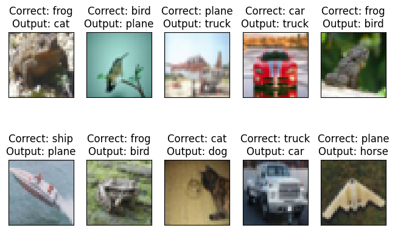

# Normalization and Regularization


## Code Details

<a target="_blank" href="https://colab.research.google.com/github/Shilpaj1994/ERA/blob/master/Session8/S8_batch.ipynb">
  
</a>

This repository contains following files:

- `model.py`: Contains model architectures
- `training_utils.py`: Contains functions to train the model on training and test dataset
- `utils.py`: Contains functions to print out statistics, model summary and get the misclassified images
- `visualize.py`: Contains functions to display data samples, misclassified images and training graphs
- `S8_batch`: Code to train model on CIFAR dataset with Batch Normalization
- `S8_layer`: Code to train model on CIFAR dataset with Layer Normalization
- `S8_group`: Code to train model on CIFAR dataset with Group Normalization

Models in above files achieve 70%+ accuracy under 50,000 parameters within 20 epochs


---


## Concepts

### Data Normalization

- It is a process of changing the range of pixel intensity values
- Normalization only changes the scale of the data and does not destroy the data
- It is possible to revert back and obtain original data
- Changing the scale helps in focusing on features at the same scale


### Data Standardization

- It is a process of shifting all pixel values between 0 and 1
- It does not destroys the original data
- Recovery of original data is possible


### Data Equilization

- It is a process of evenly distributing intensity level i.e. to make sure the number of pixels in each intensity bins are equal
- It destroys the original data
- Data recovery is not possible
- It create images which are more pleasing to human eye


 

---


## Loss and Weights with/without Normalization

- If the input channels of the layer are not normalized, different channels may be available at different amplitudes
- Hence the weights updated that need to be done by Backpropagation will be at different scales
- Imagine some channels with data in the range of -1000 to 1000 while others in the range of -1 to 1
- Weight update required for a channels will be very different
- This will make it very difficult for the backpropagation to update the weights
- The weights graph for two weights might look something like this


- It will be easier for the w1 to reach at a location which will give minimum loss value while it will take a long time for w2 to reach at that point
- This will increase the number of iterations and training time

- To overcome this issue, if we normalize the channel, all the features will be re-oriented on the same scale
- Since the features are aligned on the same scale, the weights will also be on the same scale
- This will help the Backpropagation to update the weights
- Resulting is faster training and increasing efficiency of the model
- After normalization, the weight graph will look something like this 


- Thus, taking lesser iteration to reach the weight values which will output minimum loss


---


## Batch Normalization

- It was introduced in 2015 and is the main reason to why we can create deeper networks

- In the batch normalization, we calculate mean($\mu$) and variance($\sigma^2$) of all the  $n^{th}$ input channels in a batch

- These values are used to change the scale of these channels values in the range of -1 to 1

- These updated channels are used by further layers

- Because of batch normalization, after every layer we scale the feature down to -1 to 1 scale and hence avoid the problem of exploding gradients

- This allows us to build deeper network

- Below figure shows how the number of layer increased after the Batch Normalization

  

- It solves the problem of Internal Covariance Shift i.e. features at different scales

- In simple words, Batch Normalization enhance the features for the next layer so training becomes faster and easier

- Here's the mathematical equation for Batch Normalization algorithm


- The beauty of this equation are the parameters $\gamma$ and $\beta$. They take care of the scale and sift variance

- If the image is already normalized or does not need normalization, the Backpropagation will make these parameters 0 and eliminate the effect of Batch Normalization for the layer

- This eliminates the need of **accurate** hyper-parameter optimization 

- Here's an example of VGG trained with Batch Normalization with different learning rates 

  

- It is clearly visible that the model with Batch Normalization converges faster and in case of higher learning rate of 0.5, it is still able to converge and achieve the accuracy which is very difficult without it


---


## Types of Normalization

- There are different types of normalization algorithms which were developed post Batch Normalization
- Batch Normalization, normalizes all the $n^{th}$ input channels in a batch
- Layer Normalization, normalized all the input channels altogether
- Group Normalization, create group among channels and normalizes them

- Below is how the mean and variance is calculated for Batch, Layer and Group Normalization. [File Link](https://github.com/Shilpaj1994/ERA/blob/master/Session8/Normalizations.xlsx)


- As per rumors, Batch Normalization became obsolete and was replaced by Layer or Group normalization
- This is not true and can be evident from the 3 notebooks which contains model trained on CIFAR10 dataset
- All the parameters for model training are same, the only difference is the type of normalization layer used

|                         | Batch Normalization            | Layer Normalization             | Group Normalization                            |
| ----------------------- | ------------------------------ | ------------------------------- | ---------------------------------------------- |
| Number of Parameters    | 44,640                         | 44,640                          | 44,640                                         |
| Best Train Accuracy (%) | 72.91                          | 70.69                           | 70.41                                          |
| Best Test Accuracy (%)  | 73.27                          | 71.51                           | 71.88                                          |
| Number of Means         | Input Channels                 | Images per Batch                | (Input Channels / Groups) * Batch Size         |
| Number of Variances     | Input Channels                 | Images per Batch                | (Input Channels / Groups) * Batch Size         |
| PyTorch Implementation  | `nn.BatchNorm2d(out_channels)` | `nn.GroupNorm(1, out_channels)` | `nn.GroupNorm(number_of_groups, out_channels)` |

- From the above table, it is clear that Batch Normalization outperformed Layer and Group normalization
- Below are the training graphs and misclassified images for each model

| Batch Normalization                     | Layer Normalization                                          | Group Normalization                                          |
| --------------------------------------- | ------------------------------------------------------------ | ------------------------------------------------------------ |
|      |               |         |
|  |  |  |

- State-of-the-Art models use:

  - Batch Normalization for Vision based problems

  - Layer Normalization for NLP


---


## L1 and L2 Regularization

- Regularization techniques are used to prevent overfitting
- L1 and L2 are the most common regularization techniques
- They update the general cost function by adding another term known as the regularization term


### L1 [Lasso Regression]

- L1 regularization adds an L1 penalty equal to the absolute value of the **magnitude of coefficients**. Basically, we make some kernel values 0
- When our input features have weights closer to zero this leads to a sparse L1 norm
- In the Sparse solution, the majority of the input features have zero weights and very few features have non-zero weights


- L1 penalizes the sum of the absolute value of weights
- L1 has a sparse solution 
- L1 generates a model that is simple and interpretable but cannot learn complex patterns 
- L1 is robust to outliers

```python
# PyTorch Implementation

# Loss Function
loss = mse(predictions, targets)

# Constants
l1 = 0
lambda_l1 = 0.1

# Calculate the sum of all the parameters
for param in network.parameters():
    l1 = l1 + param.abs().sum()

# Updated loss to include L1 regularizer
loss = loss + lambda_l1 * l1

# Backpropagation
loss.backward()
optimizer.step()
```


### L2 [Ridge Regularization]

- L2 regularization is similar to L1 regularization. But it adds a **squared magnitude of coefficient** as a penalty term to the loss function. 
- L2 will *not* yield sparse models and all coefficients are shrunk by the same factor (none are eliminated like L1 regression)


- L2 regularization penalizes the sum of square weights. 
- L2 has a non-sparse solution 
- L2 regularization is able to learn complex data patterns 
- L2 has no feature selection 
- L2 is not robust to outliers

```python
# PyTorch Implementation

# Use optimizer with weight decay for L2
optimizer_sgd = torch.optim.SGD(network.parameters(), lr=1e-4, momentum=0, dampening=0, weight_decay=0, nesterov=False)

# Use optimizer with weight decay for L2
optimizer_adam = torch.optim.Adam(network.parameters(), lr=1e-4, weight_decay=1e-5)
```

