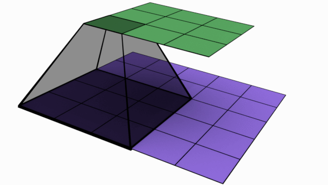
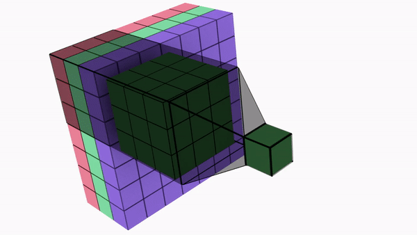
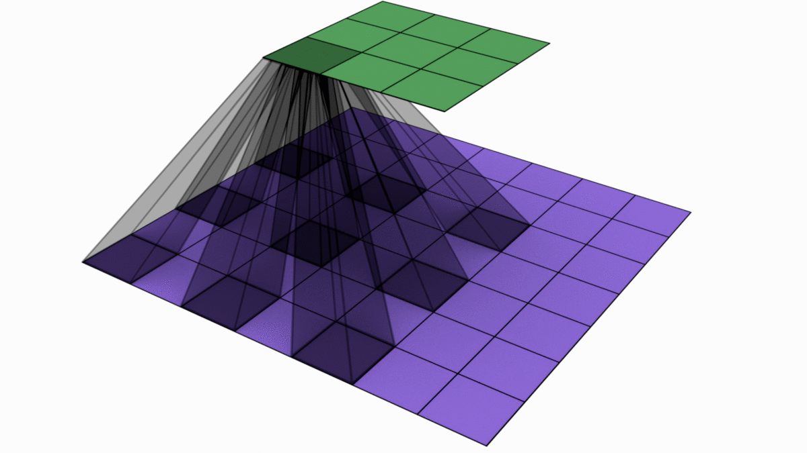
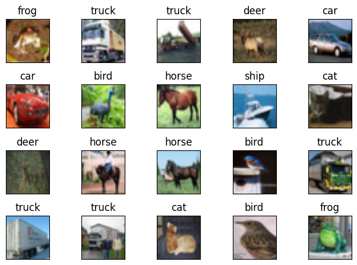

# Advance Convolutions


### Convolutional Layer

- Used as a **Feature Extractor**

- Most commonly used as Nvidia hardware and software is optimized for 3x3 kernels

- Input: Blue colored single channel of 5x5

  Kernel: Dark blue colored single channel of 3x3

  Feature map: Green colored single channel of 3x3 
  When input channel is convolved with the kernel, feature map is created. This way convolution is used to extract features



- Above images showcase a convolution operation for single channel

- For an input image of 3 channels(RGB), below is the operation

  

  Kernel should have number of channels equal to number of input channels

```python
# PyTorch Implementation
nn.Conv2d(in_channels=3, out_channels=32, stride=1, kernel_size=3, bias=False, padding=0)
```


### Point Convolution

- Used to **Combine Features**
- It is also used to increase or decrease the number of channels in a layer

```python
# PyTorch Implementation
nn.Conv2d(in_channels=3, out_channels=32, stride=1, kernel_size=1)   # Increase number of channels
nn.Conv2d(in_channels=32, out_channels=10, stride=1, kernel_size=1)  # Decrease number of channels
```

- Here, 1x1 is used to reduce the number of channels from 192 to 32. It combines the features from multiple channels to preserve the information


### Depthwise Separable Convolution Layer

- Used to **reduce number of parameters** in a layer
- As a feature extractor, it is 15-20% less efficient compared to the conventional convolution
- Instead of having a kernel with same number of channels as of input, each input channels is convolved with separate single channel kernel
- After this operation, 1x1 with multiple channels is used to mix the features and create a feature map with multiple channels


```python
# PyTorch Implementation
nn.Sequential(
nn.Conv2d(in_channels=3, out_channels=3, stride=1, groups=3, kernel_size=3, bias=False, padding=1),
nn.Conv2d(in_channels=3, out_channels=10, stride=1, kernel_size=1, bias=False, padding=0)
)
```


### Dilated/Atrous Convolution Layer

- Used to **increase receptive field of the network exponentially**

- Used for **dense predictions** - semantic/panoptic segmentations, super-resolution, denoising, generative art, keypoint detection, pose estimation, etc

- They help to identify the continuation of the feature and hence they are used after normal convolution layer

- Input: Blue colored single channel of 7x7

  Kernel: Dark blue colored single channel of 3x3 with a dilation of 2

  Feature map: Green colored single channel of 3x3 
  When input channel is convolved with the such kernel, we get a receptive field of 5x5 instead of 3x3(as with normal convolution)




```python
# PyTorch Implementation
nn.Conv2d(in_channels=3, out_channels=32, stride=1, kernel_size=3, bias=False, padding=0, dilation=2)
```


### Spatial Separable Convolution

- Used to **reduce total number of parameters**
- It was immensely used in different variants of Xception-Inception Networks as well as in MobileNets
- It is obsolete since mobile phone hardware is made powerful enough to handle normal convolutions

```python
# PyTorch Implementation
nn.Sequential(
nn.Conv2d(in_channels=3, out_channels=1, stride=1, kernel_size=(3, 1), bias=False, padding=0),
nn.Conv2d(in_channels=1, out_channels=32, stride=1, kernel_size=(1, 3), bias=False, padding=0)
)
```


### Transpose Convolution

- Used to **increase channel size after convolution**
- Used in all the dense problems
- In this image, we can see an image of 3x3 (blue color) is being convolved with a kernel of 3x3 (gray color) to output a 5x5 channel (green color)


```python
# PyTorch Implementation
nn.Sequential(nn.ConvTranspose2d(in_channels=1, out_channels=1, kernel_size=3, bias=False,
                                 stride=1, padding=0, output_padding=0))
```


---


## CIFAR10 Model

<a target="_blank" href="https://colab.research.google.com/github/Shilpaj1994/ERA/blob/master/Session9/S9.ipynb">
  
</a>

Files in this repository are:

- `dataset.py`: Contains class to use with [albumentations](https://github.com/albumentations-team/albumentations) library 
- `model.py`: Contains model architecture
- `training_utils`: Contains train, test functions required for model training
- `utils.py`: Contains functions to get misclassified data, dataset statistics and model summary
- `visualize.py`: Contains functions to visualize data samples, augmentations, and misclassified images
- `S9.ipynb`: Notebook to train the model


### Code Details:

In the notebook, I followed the below steps:

- Importing above files and dataset

- Checked the statistics of the datasets

  ```txt
  [Train]
   - Total Train Images: 50000
   - Tensor Shape: (3, 32, 32)
   - min: (0.0, 0.0, 0.0)
   - max: (1.0, 1.0, 1.0)
   - mean: (0.49139968, 0.48215827, 0.44653124)
   - std: (0.24703233, 0.24348505, 0.26158768)
   - var: (0.061024975, 0.05928497, 0.06842812)
  [Test]
   - Total Test Images: 10000
   - Tensor Shape: (3, 32, 32)
   - min: (0.0, 0.0, 0.0)
   - max: (1.0, 1.0, 1.0)
   - mean: (0.49421427, 0.48513183, 0.45040932)
   - std: (0.24665256, 0.24289224, 0.26159248)
   - var: (0.06083748, 0.058996636, 0.06843062)
  ```

- Visualize some images from training dataset

  

- Decide the transformations based on the data samples and data statistics

- Visualize the augmentation strategies

  

  

- Import the model and print the model summary

  ```python
  ----------------------------------------------------------------
          Layer (type)               Output Shape         Param #
  ================================================================
              Conv2d-1           [-1, 32, 32, 32]             864
                ReLU-2           [-1, 32, 32, 32]               0
         BatchNorm2d-3           [-1, 32, 32, 32]              64
             Dropout-4           [-1, 32, 32, 32]               0
              Conv2d-5           [-1, 32, 32, 32]             288
              Conv2d-6           [-1, 32, 34, 34]           1,024
                ReLU-7           [-1, 32, 34, 34]               0
         BatchNorm2d-8           [-1, 32, 34, 34]              64
             Dropout-9           [-1, 32, 34, 34]               0
             Conv2d-10           [-1, 32, 16, 16]           9,216
               ReLU-11           [-1, 32, 16, 16]               0
        BatchNorm2d-12           [-1, 32, 16, 16]              64
            Dropout-13           [-1, 32, 16, 16]               0
             Conv2d-14           [-1, 40, 16, 16]          11,520
               ReLU-15           [-1, 40, 16, 16]               0
        BatchNorm2d-16           [-1, 40, 16, 16]              80
            Dropout-17           [-1, 40, 16, 16]               0
             Conv2d-18           [-1, 40, 16, 16]          14,400
               ReLU-19           [-1, 40, 16, 16]               0
        BatchNorm2d-20           [-1, 40, 16, 16]              80
            Dropout-21           [-1, 40, 16, 16]               0
             Conv2d-22             [-1, 40, 7, 7]          14,400
               ReLU-23             [-1, 40, 7, 7]               0
        BatchNorm2d-24             [-1, 40, 7, 7]              80
            Dropout-25             [-1, 40, 7, 7]               0
             Conv2d-26             [-1, 40, 7, 7]          14,400
               ReLU-27             [-1, 40, 7, 7]               0
        BatchNorm2d-28             [-1, 40, 7, 7]              80
            Dropout-29             [-1, 40, 7, 7]               0
             Conv2d-30             [-1, 40, 7, 7]          14,400
               ReLU-31             [-1, 40, 7, 7]               0
        BatchNorm2d-32             [-1, 40, 7, 7]              80
            Dropout-33             [-1, 40, 7, 7]               0
             Conv2d-34             [-1, 40, 3, 3]          14,400
               ReLU-35             [-1, 40, 3, 3]               0
        BatchNorm2d-36             [-1, 40, 3, 3]              80
            Dropout-37             [-1, 40, 3, 3]               0
             Conv2d-38             [-1, 64, 3, 3]          23,040
               ReLU-39             [-1, 64, 3, 3]               0
        BatchNorm2d-40             [-1, 64, 3, 3]             128
            Dropout-41             [-1, 64, 3, 3]               0
             Conv2d-42             [-1, 64, 3, 3]          36,864
               ReLU-43             [-1, 64, 3, 3]               0
        BatchNorm2d-44             [-1, 64, 3, 3]             128
            Dropout-45             [-1, 64, 3, 3]               0
             Conv2d-46             [-1, 64, 3, 3]          36,864
               ReLU-47             [-1, 64, 3, 3]               0
        BatchNorm2d-48             [-1, 64, 3, 3]             128
            Dropout-49             [-1, 64, 3, 3]               0
  AdaptiveAvgPool2d-50             [-1, 64, 1, 1]               0
             Conv2d-51             [-1, 10, 1, 1]             640
  ================================================================
  Total params: 193,376
  Trainable params: 193,376
  Non-trainable params: 0
  ----------------------------------------------------------------
  Input size (MB): 0.01
  Forward/backward pass size (MB): 3.50
  Params size (MB): 0.74
  Estimated Total Size (MB): 4.25
  ----------------------------------------------------------------
  ```

- Train the Model for 100 epochs to achieve accuracy of 85%

  

- Visualize the training and test accuracies and losses

  

- Visualize the misclassified data

  

  

